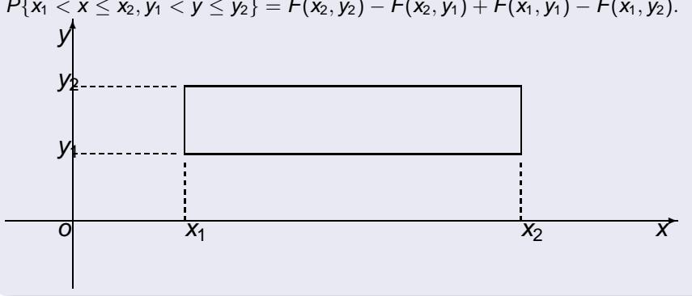

# 第三章多维随机变量及其分布

# 毛雪峰

上海大学理学院数学系

12月21日～12月30日

二维随机变量

边缘分布

条件分布

相互独立的随机变量

两个随机变量的函数的分布

# 内容介绍

0

二维随机变量

②

边缘分布

③

条件分布

相互独立的随机变量

5

两个随机变量的函数的分布

维随机变量

边缘分布

条件分布

相互独立的随机变量

两个随机变量的函数的分布

# Outline

二维随机变量

边缘分布

3

条件分布

4

相互独立的随机变量

5

两个随机变量的函数的分布

边缘分布

条件分布

相互独立的随机变量

# 3.1.1二维随机变量的定义

设随机试验E的样本空间为S,设X和Y是定义在样本空间S上的随机变量,由它们构成的一个向量(X,Y),叫做二维随机向量或二维随机变量.

# 3.1.2二维随机变量分布函数定义

设(X,Y)是二维随机变量,对于任意实数x,y二元函数:

F(x,y)=P{(X≤x)n(Y≤y)}x P{X≤x,Y≤y)称为二维随机变量(X，Y的分布函数，或称随机变量X和Y的联合分布函数.

边缘分布

条件分布

相互独立的随机变量

# 3.1.1二维随机变量的定义

设随机试验E的样本空间为S,设×和 $\textsf { Y }$ 是定义在样本空间S上的随机变量,由它们构成的一个向量 $( X , Y )$ ,叫做二维随机向量或二维随机变量.

# 3.1.2二维随机变量分布函数定义

设(X,Y)是二维随机变量,对于任意实数x,y二元函数:

F(x,y)=P{(X≤x)n(Y≤y)} lε盛 P{X≤x,Y≤y}称为二维随机变量(X，Y的分布函数,或称随机变量X和Y的联合分布函数.

边缘分布

条件分布

相互独立的随机变量

# 3.1.1二维随机变量的定义

设随机试验E的样本空间为S,设×和 $\textsf { Y }$ 是定义在样本空间S上的随机变量,由它们构成的一个向量 $( X , Y )$ ,叫做二维随机向量或二维随机变量.

# 3.1.2二维随机变量分布函数定义

设 $( X , Y )$ 是二维随机变量，对于任意实数 $x , y .$ 二元函数：

F( $x , y ) = P \{ ( X \leq x ) \cap ( \mathsf { Y } \leq y ) \} \xrightarrow { \mathrm { i } \sharp \sharp \sharp } P \{$ X≤x,Y≤y}称为二维随机变量 $( X , Y )$ 的分布函数,或称随机变量×和Y的联合分布函数.

边缘分布

相互独立的随机变量

# 3.1.3随机点(X，Y)落在矩形区域的概率

二维随机变量

边缘分布

条件分布

相互独立的随机变量

# 3.1.4联合分布函数F(x,y)的性质

F(x,y)是变量x和y的不减函数,即

(1)对于任意固定的y,当x>x1时,F(x2,y）≥F(x1,y)；

(2)对于任意固定的x,当y2>y1时,F(x,y2)≥F(x,y1).

0≤F(x,y)≤1,F(-∞0,-00)=0,F(00,00)=1.并且对于 任意固定的x,y,F(-oo,y）=F(x,-0）=0.

F(x+0,y)= F(x,y),F(x,y+0)= F(x,y),即F(x,y)关于x右连续,关于y也右连续.

对于任意(X1,y1),(X2,y2),X1 <X2,y1<y2,下述不等式成立:F(X2,y2)-F(X2,y1)+ F(X1,y1) -F(X1,y2)≥0.

边缘分布

条件分布

相互独立的随机变量

# 3.1.4联合分布函数F(x,y)的性质

F(x,y)是变量x和y的不减函数,即(1)对于任意固定的y,当x2>x1时,F(x2,y)≥F(x1,y);(2)对于任意固定的x，当y2>y1时，F(x,y2)≥F(x,y1).

<（xy）<（）1并对

④对于任意(x1,y1)，(x2,y2)，x1<X2,y1<y2,下述不等式成立：F(X2,V2）-F（X2,yi)+F(X1,y1)-F（X1,V2)≥0.

二维随机变量

边缘分布

条件分布

相互独立的随机变量

# 3.1.4联合分布函数F(x，y)的性质

$\boldsymbol { F } ( \boldsymbol { x } , \boldsymbol { y } )$ 是变量x和y的不减函数,即(1)对于任意固定的y，当x2>x1时，F(2)对于任意固定的x,当y2>y1时，F

对于任意(x1,y1)，(x2,y2),x1<x2,y1<y2，下述不等式成立：F(X2,y2)-F(X2,yi)+F(x1,y1)-F（X1,y2）≥0.

二维随机变量

边缘分布

条件分布

相互独立的随机变量

# 3.1.4联合分布函数F(x，y)的性质

$\boldsymbol { F } ( \boldsymbol { x } , \boldsymbol { y } )$ 是变量x和y的不减函数,即

(1)对于任意固定的y，当 $x _ { 2 } > x _ { 1 }$ 时 ${ \cal F } ( x _ { 2 } , y ) \geq { \cal F } ( x _ { 1 } , y ) ;$

（2）对于任意固定的x，当y2>y1时，F（x,y2）≥F（x，y1）.

②0≤F(x,y）≤1,F（-∞,-∞∞)=0,F(∞0,∞o)=1.并且对于 任意固定的x,y,F(-oo,y）=F(x,-00）=0.

对于任意(x1,y1),(x2,y2),x1<X2,y1<y2,下述不等式成立：F(X2,y2)-F(X2,y1)+F(X1,y1）-F（X1,y2)≥0.

二维随机变量

边缘分布

条件分布

相互独立的随机变量

# 3.1.4联合分布函数F(x，y)的性质

$\boldsymbol { F } ( \boldsymbol { x } , \boldsymbol { y } )$ 是变量x和y的不减函数,即

(1)对于任意固定的y,当 $x _ { 2 } > x _ { 1 }$ 时 $, F ( x _ { 2 } , y ) \ge F ( x _ { 1 } , y ) ;$ 1

(2)对于任意固定的 $x$ 当 $y _ { 2 } > y _ { 1 }$ 时 $F ( x , y _ { 2 } ) \geq F ( x , y _ { 1 } ) .$

F(x+0,y)=F(x,y)，F(x,y+0)=F(x,y),即F(x,y)关于x右连续,关于y也右连续.

二维随机变量

边缘分布

条件分布

相互独立的随机变量

# 3.1.4联合分布函数F(x，y)的性质

$\boldsymbol { F } ( \boldsymbol { x } , \boldsymbol { y } )$ 是变量x和y的不减函数,即

(1)对于任意固定的y,当 $x _ { 2 } > x _ { 1 }$ 时 $, F ( x _ { 2 } , y ) \ge F ( x _ { 1 } , y ) ;$

(2)对于任意固定的 $x ,$ 当 $y _ { 2 } > y _ { 1 }$ 时 $F ( x , y _ { 2 } ) \geq F ( x , y _ { 1 } ) .$

$0 \le F ( x , y ) \le 1$ ， $F ( - \infty , - \infty ) = 0 , F ( \infty , \infty ) = 1$ .并且对于任意固定的 $x , y , F ( - \infty , y ) = F ( x , - \infty ) = 0 .$

F(x+0,y)=F(x,y),F(x,y+0)=F(x,y),即F(x,y)关 于x右连续,关于y也右连续.

对于任意(x1,y1)，(x2,y2),x1<X2,y1<y2，下述不等式成立：F(X2,y2)-F(x2,y1)+F(x1,y1)-F（x1,y2)≥0.

二维随机变量

边缘分布

条件分布

相互独立的随机变量

# 3.1.4联合分布函数F(x，y)的性质

$\boldsymbol { F } ( \boldsymbol { x } , \boldsymbol { y } )$ 是变量x和y的不减函数,即

(1)对于任意固定的y,当 $x _ { 2 } > x _ { 1 }$ 时 $, F ( x _ { 2 } , y ) \ge F ( x _ { 1 } , y ) ;$

(2)对于任意固定的 $x ,$ 当 $y _ { 2 } > y _ { 1 }$ 时 $F ( x , y _ { 2 } ) \geq F ( x , y _ { 1 } ) .$

$0 \le F ( x , y ) \le 1$ ， $F ( - \infty , - \infty ) = 0 , F ( \infty , \infty ) = 1$ .并且对于任意固定的 $x , y , F ( - \infty , y ) = F ( x , - \infty ) = 0 .$

F(x $+ 0 , y ) = F ( x , y ) , F ( x , y + 0 ) = F ( x , y$ 即 $\boldsymbol { F } ( \boldsymbol { x } , \boldsymbol { y } )$ 关于x右连续,关于y也右连续.

二维随机变量

边缘分布

条件分布

相互独立的随机变量

# 3.1.4联合分布函数F(x，y)的性质

$\boldsymbol { F } ( \boldsymbol { x } , \boldsymbol { y } )$ 是变量x和y的不减函数,即

(1)对于任意固定的y,当 $x _ { 2 } > x _ { 1 }$ 时 $, F ( x _ { 2 } , y ) \ge F ( x _ { 1 } , y ) ;$

(2)对于任意固定的 $x ,$ 当 $y _ { 2 } > y _ { 1 }$ 时 $F ( x , y _ { 2 } ) \geq F ( x , y _ { 1 } ) .$

$0 \le F ( x , y ) \le 1$ ， $F ( - \infty , - \infty ) = 0 , F ( \infty , \infty ) = 1$ .并且对于任意固定的 $x , y , F ( - \infty , y ) = F ( x , - \infty ) = 0 .$

F(x + $, y ) = F ( x , y ) , F ( x , y + 0 ) = F ( x , y )$ 即 $\boldsymbol { F } ( \boldsymbol { x } , \boldsymbol { y } )$ 关于x右连续,关于y也右连续.

对于任意 $( x _ { 1 } , y _ { 1 } ) , ( x _ { 2 } , y _ { 2 } ) , x _ { 1 } < x _ { 2 } , y _ { 1 } < y _ { 2 }$ 下述不等式成立：F( $\dot { \bf \rho } _ { 2 } ) - F ( x _ { 2 } , y _ { 1 } ) + F ( x _ { 1 } , y _ { 1 } ) - F ( x _ { 1 } , y _ { 2 } ) \geq$ 0.

二维随机变量

边缘分布

条件分布

相互独立的随机变量

# 3.1.5离散型二维随机变量

）定义 如果二维随机变量(X,Y)全部可能取到的值是有限对或可列无限多对,则称(X,Y)是离散型的随机变量.

设(xi,yj),i,j=1,2,…,是二维离散型随机变量(X,Y)的所有可能取值.

记P{-x

称P{X=xj,Y=yj}=Pij,i,j=1,2,..为二维随机变量(X,Y)的分布律，或称随机变量X和Y的联合分布.

边缘分布

条件分布

相互独立的随机变量

# 3.1.5离散型二维随机变量

D定义 如果二维随机变量(X，Y)全部可能取到的值是有限对或可列无限多对,则称(X，Y是离散型的随机变量

设(xi,yj),i,j=1,2,…,是二维离散型随机变量(X，Y)的所有可能取值

记P{X=xi,Y=y)}=Pij，则pj≥0,∑∑pj=1.

二维随机变量

边缘分布

条件分布

相互独立的随机变量

# 3.1.5离散型二维随机变量

定义 如果二维随机变量(X,Y)全部可能取到的值是有限对或可列无限多对，则称 $( X , Y )$ 是离散型的随机变量.

设(xi,yj),i,j=1,2,,是二维离散型随机变量(X,Y)的所有可能取 自

记P{X=x),Y=y}=Pj,则pj≥0,∑∑Pij=1.

二维随机变量

边缘分布

条件分布

相互独立的随机变量

# 3.1.5离散型二维随机变量

定义如果二维随机变量 $( X , Y )$ 全部可能取到的值是有限对或可列无限多对，则称 $( X , Y )$ 是离散型的随机变量.

设 $( x _ { i } , y _ { j } ) , i , j = 1 , 2 , \cdot \cdot \cdot$ ,是二维离散型随机变量 $( X , Y )$ 的所有可能取值.

称P{X=xj，,Y=y}=Pij,i,j=1,2,.为二维随机量(X,Y)的分布律，或称随机变量X和Y的联合分布.

二维随机变量

边缘分布

条件分布

相互独立的随机变量

# 3.1.5离散型二维随机变量

定义如果二维随机变量 $( X , Y )$ 全部可能取到的值是有限对或可列无限多对，则称 $( X , Y )$ 是离散型的随机变量.

设 $( x _ { i } , y _ { j } ) , i , j = 1 , 2 , \cdot \cdot \cdot$ ,是二维离散型随机变量 $( X , Y )$ 的所有可能取值.

记 $ X = x _ { i } , Y = y _ { j } \} = p _ { i j } , \mathbb { M } p _ { i j } \ge 0 , \sum _ { i = 1 } ^ { \infty } \sum _ { j = 1 } ^ { \infty } { F }$ Dj =1.

称P{X=xj，,Y=y}=Pij,i,j=1,2,.为二维随机量(X,Y)的分布律，或称随机变量X和Y的联合分布.

二维随机变量

边缘分布

条件分布

相互独立的随机变量

# 3.1.5离散型二维随机变量

定义如果二维随机变量 $( X , Y )$ 全部可能取到的值是有限对或可列无限多对，则称 $( X , Y )$ 是离散型的随机变量.

设 $( x _ { i } , y _ { j } ) , i , j = 1 , 2 , \cdot \cdot \cdot$ ,是二维离散型随机变量 $( X , Y )$ 的所有可能取值.

记 $= x _ { i } , Y = y _ { j } \} = p _ { i j } , \mathbb { M } p _ { i j } \geq 0 , \sum _ { i = 1 } ^ { \infty } \sum _ { j = 1 } ^ { \infty } p _ { i j }$

称 $P \{ X = x _ { i }$ ， $Y = y _ { j } \} = p _ { i j } , i , j = 1 , 2 , \cdot \cdot \cdot$ 为二维随机变量 $( X , Y )$ 的分布律,或称随机变量 $X$ 和 $\textsf { Y }$ 的联合分布.

二维随机变量

边缘分布

条件分布

相互独立的随机变量

<table><tr><td>X Y</td><td>X1 X2</td><td></td><td>Xi</td><td></td></tr><tr><td></td><td>P11</td><td>P21</td><td>Pi1</td><td></td></tr><tr><td>Y</td><td>P12</td><td>P22</td><td>Pi2</td><td></td></tr><tr><td>：</td><td></td><td></td><td></td><td></td></tr><tr><td></td><td></td><td></td><td></td><td></td></tr><tr><td>yj</td><td>p1j</td><td>P2j</td><td>Pij</td><td></td></tr><tr><td></td><td></td><td></td><td></td><td></td></tr><tr><td></td><td></td><td></td><td></td><td></td></tr><tr><td></td><td></td><td></td><td></td><td></td></tr></table>

二维随机变量

边缘分布

条件分布

相互独立的随机变量

# 3.1.6二维离散型随机变量分布的表格表示法

<table><tr><td>Y</td><td>×</td><td>X1 X2</td><td></td><td>Xi</td><td></td></tr><tr><td>y1</td><td>P11</td><td>P21</td><td></td><td>Pi1</td><td></td></tr><tr><td>y2</td><td>P12</td><td>P22</td><td></td><td>Pi2</td><td></td></tr><tr><td>：</td><td>：</td><td>：</td><td>：</td><td></td><td></td></tr><tr><td></td><td></td><td></td><td></td><td>：</td><td></td></tr><tr><td>yi</td><td>p1j</td><td>P2j</td><td></td><td>pij</td><td></td></tr><tr><td></td><td></td><td></td><td></td><td></td><td></td></tr><tr><td>：</td><td>：</td><td>：</td><td></td><td>：</td><td></td></tr><tr><td></td><td></td><td></td><td></td><td></td><td></td></tr></table>

二维随机变量

边缘分布

条件分布

相互独立的随机变量

# 例3.1.1

设随机变量X在1,2,3,4四个整数中等可能的取一个值另一个随机变量Y在1～X中等可能地取一整数值.试求(X,Y)的分布律.

解:对∀i=1,2,3,4,j≤i,由乘法定理得 P{X=i,Y=)=P{Y=jX=nP{X=}=14=47.

于是(X,Y)的分布律为

<table><tr><td>× Y</td><td>1 2</td><td>3</td><td>4</td></tr><tr><td>1</td><td>N</td><td>12121夜0</td><td></td></tr><tr><td>23</td><td></td><td></td><td></td></tr><tr><td></td><td>GR 0</td><td></td><td></td></tr><tr><td>4</td><td>0 0</td><td></td><td></td></tr></table>

设随机变量×在1,2,3,4四个整数中等可能的取一个值另一个随机变量Y在 $1 \sim X$ 中等可能地取一整数值.试求 $( X , Y )$ 的分布律.

解：对 $\forall i = 1 , 2 , 3 , 4 , j \leq i ,$ 由乘法定理得

$$
\begin{array} { r } { \textsf { Y } = j \} = P \{ \textsf { Y } = j | X = i \} P \{ X = i \} = \frac { 1 } { i } \frac { 1 } { 4 } : } \end{array}
$$

于是 $( X , Y )$ 的分布律为

<table><tr><td>Y</td><td>X</td><td>1 2</td><td></td><td>3</td><td>4</td></tr><tr><td>1</td><td></td><td>4</td><td></td><td></td><td></td></tr><tr><td>2</td><td></td><td>1U 0</td><td></td><td>立</td><td>中</td></tr><tr><td>3</td><td></td><td>0</td><td></td><td></td><td></td></tr><tr><td>4</td><td></td><td>0</td><td>0</td><td>0</td><td></td></tr></table>

边缘分布

条件分布

相互独立的随机变量

两个随机变量的函数的分布

# 3.1.7离散型随机变量×和Y的联合分布函数的计算公式

# 3.1.8连续型二维随机变量的定义

若二维随机变量(X,Y)的分布函数F(X,y),如果存在非负可积函数f(x,y)，使得于任意x,y有F(x,y)=JJf（u,v)dudv，则称(X,Y)是连续型的二维随机变量，函数f(x,y)称为二维随机变量(X，Y)的概率密度,或称为随机变量X和Y的联合概率密度.

边缘分布条件分布

相互独立的随机变量

# 3.1.7离散型随机变量×和Y的联合分布函数的计算公式

$$
( x , y ) = P \{ X \leq x , Y \leq y \} = \sum _ { x _ { i } \leq x } \sum _ { y _ { j } \leq y } p _ { i }
$$

# 3.1.8连续型二维随机变量的定义

若二维随机变量(X,Y)的分布函数F(X,y),如果存在非负可积函数f(x,y)，使得于任意x,y有F(x,y)=JJf（u,v)dudv，则称(X,Y)是连续型的二维随机变量，函数f(x,y)称为二维随机变量(X，Y)的概率密度,或称为随机变量X和Y的联合概率密度.

二维随机变量边缘分布条件分布

相互独立的随机变量

# 3.1.7离散型随机变量×和Y的联合分布函数的计算公式

$$
( x , y ) = P \{ X \leq x , Y \leq y \} = \sum _ { x _ { i } \leq x } \sum _ { y _ { j } \leq y } p _ { i }
$$

# 3.1.8连续型二维随机变量的定义

若二维随机变量(X,Y)的分布函数 $\boldsymbol { F } ( \boldsymbol { x } , \boldsymbol { y } )$ ,如果存在非负可积函数 $f ( x , y )$ ，使得对于任意x,y有 $\begin{array} { r } { F ( x , y ) = \int _ { - \infty } ^ { y } \int _ { - \infty } ^ { x } f ( u , v ) d u d v , } \end{array}$ 则称 $( X , Y )$ 是连续型的二维随机变量,函数 $f ( x , y )$ 称为二维随机变量 $( X , Y )$ 的概率密度,或称为随机变量×和 $\textsf { Y }$ 的联合概率密度.

# 3.1.9联合概率密度的性质

f(x,y）≥0

）设G是xOy平面上的区域,点(X,Y)落在G内的概率为

若f(x,y)在点(x,y)连续,则有

二维随机变量

边缘分布

条件分布

相互独立的随机变量

# 3.1.9联合概率密度的性质

设G是xOy平面上的区域，点(X，Y)落在G内的概率为

④若f(x,y)在点(x,y）连续,则有

二维随机变量

边缘分布

相互独立的随机变量

# 3.1.9联合概率密度的性质

$$
f ( x , y ) \geq 0
$$

设G是xOy平面上的区域，点(X，Y)落在G内的概率为

若f(x,y）在点(x,y）连续，则有

二维随机变量

边缘分布

# 3.1.9联合概率密度的性质

$$
\begin{array} { l } { { \displaystyle f ( x , y ) \geq 0 } } \\ { { \displaystyle \int _ { - \infty } ^ { \infty } \int _ { - \infty } ^ { \infty } f ( x , y ) d x d y = F ( } } \end{array}
$$

设G是xOy平面上的区域，点(X,Y)落在G内的概率为

若f(x，y）在点(x，y）连续,则有

边缘分布

# 3.1.9联合概率密度的性质

$$
\begin{array} { l } { { { \displaystyle { \cal F } ( x , y ) \geq 0 } } } \\ { { { \displaystyle \int _ { - \infty } ^ { \infty } \int _ { - \infty } ^ { \infty } f ( x , y ) d x d y = F ( \infty } } } \end{array}
$$

设G是xOy平面上的区域,点 $( X , Y )$ 落在 $\boldsymbol { G }$ 内的概率为

$$
P \{ ( X , Y ) \in G \} = \int _ { G } f ( x , y ) d x d y .
$$

若f(x,y)在点(x，y)连续,则有

# 3.1.9联合概率密度的性质

$$
\begin{array} { l } { { { \displaystyle { \cal F } ( x , y ) \geq 0 } } } \\ { { { \displaystyle \int _ { - \infty } ^ { \infty } \int _ { - \infty } ^ { \infty } f ( x , y ) d x d y = F ( \infty } } } \end{array}
$$

设G是xOy平面上的区域,点 $( X , Y )$ 落在 $\boldsymbol { G }$ 内的概率为

$$
P \{ ( X , Y ) \in G \} = \int _ { G } f ( x , y ) d x d y .
$$

0若 $f ( x , y )$ 在点 $( x , y )$ 连续,则有

$$
{ \frac { \partial ^ { 2 } F ( x , y ) } { \partial x \partial y } } = f ( x , y ) .
$$

边缘分布

条件分布

相互独立的随机变量

两个随机变量的函数的分布

# 推论3.1.10

若f(x,y)在点(x,y)处连续,则当△x,△y很小时，P{x<X≤x+△x,y<Y≤y+△y}\~ f(x,y)△x△y.

证明： lim

lim zχ△y[F(x+△x,y+△y)-F(x+△x,y)-F(x,y+△y)+F(x,y)l△x→0+△y → 0+

F(x=f(x,y)，因此若f(x，y）在点(x，y)处连续，则当△x,△y很小时,P{x<X≤x+△x,y<Y≤y+△y}\~ f(x,y)△x△y.

边缘分布

条件分布

相互独立的随机变量

两个随机变量的函数的分布

# 推论3.1.10

若 $f ( x , y )$ 在点 $( x , y )$ 处连续，则当 $\Delta x , \Delta y$ 很小时，

$$
\begin{array} { r } { \langle X \leq x + \Delta x , y < Y \leq y + \Delta y \rangle \approx t ( x } \end{array}
$$

证明： lim P{x<X<x+△x,y<Y<y+△y}△x→0+ △x△y△y→0+lim Zx△y[F(x+△x,y+△y)-F(x+△x,y)-F(x,y+△y)+F(x,y)]△x→△y²F(x=f(x,y)，因此若f(x,y)在点(x,y)处连续，则当△x,△y很  
小时,P{x<X≤x+△x,y<Y≤y+△y}\~f(x,y)△x△y.

边缘分布条件分布

相互独立的随机变量两个随机变量的函数的分布

# 推论3.1.10

若 $f ( x , y )$ 在点 $( x , y )$ 处连续，则当 $\Delta x , \Delta y$ 很小时，

$$
\begin{array} { r } { \langle X \leq x + \Delta x , y < Y \leq y + \Delta y \rangle \approx t ( x } \end{array}
$$

证明：

F（x=f(x,y).因此若f(x,y）在点(x,y)处连续，则当△x,△y很小时,P{x<X≤x+△x,y<Y≤y+△y}\~f(x,y)△x△y.

边缘分布

条件分布

相互独立的随机变量

若 $f ( x , y )$ 在点 $( x , y )$ 处连续，则当 $\Delta x , \Delta y$ 很小时，

$$
P \{ x < X \leq x + \Delta x , y < Y \leq y + \Delta y \}
$$

证明:lim △x→0+ P{x<X<x+△x,y<Y<y+△y} △x△y△y→0+

边缘分布

条件分布

相互独立的随机变量

若 $f ( x , y )$ 在点 $( x , y )$ 处连续，则当 $\Delta x , \Delta y$ 很小时，

$$
P \{ x < X \leq x + \Delta x , y < Y \leq y + \Delta y \}
$$

证明: $\begin{array} { r l } & { \underset { \Delta x  0 ^ { + } } { \mathrm { l i m } } \frac { P \{ x < X \leq x + \Delta x , y < Y \leq y + \Delta y \} } { \Delta x \Delta y } } \\ & { \stackrel { \Delta y  0 ^ { + } } { \Delta y  0 ^ { + } } } \\ & { \underset { \partial ^ { + } } { \mathrm { ) ^ { + } } } \frac { 1 } { \Delta x \Delta y } [ F ( x + \Delta x , y + \Delta y ) - F ( x + \Delta x , y ) - F } \\ & { \stackrel { \partial ^ { + } } { \partial ^ { + } } } \end{array}$   
lim (x,y+△y)+F(x,y)}△x→  
$\Delta y \to 0 ^ { + }$   
a²F(x=f(x,y).因此若f(x,y)在点(x,y)处连续，则当△x,△y很小时，P{x △yY f(x,y)△x△y.

边缘分布条件分布

相互独立的随机变量

若 $f ( x , y )$ 在点 $( x , y )$ 处连续，则当 $\Delta x , \Delta y$ 很小时，

$$
P \{ x < X \leq x + \Delta x , y < Y \leq y + \Delta y \}
$$

证明:· $\begin{array} { r l } & { \underset { \Delta x  0 ^ { + } } { \mathrm { l i m } } \frac { P \{ x < X \leq x + \Delta x , y < Y \leq y + \Delta y \} } { \Delta x \Delta y } } \\ & { \stackrel { \Delta y  0 ^ { + } } { \Delta y  0 ^ { + } } } \\ & { \underset { \partial ^ { + } } { \mathrm { ) ^ { + } } } \frac { 1 } { \Delta x \Delta y } [ F ( x + \Delta x , y + \Delta y ) - F ( x + \Delta x , y ) - F } \\ & { \stackrel { \partial ^ { + } } { \partial ^ { + } } } \end{array}$   
△x→ lim (x,y+△y)+F(x,y)△y→  
²F(xy) =f(x，y). 因此若f(x,y)在点(x,y)处连续，则当△x,△y很小时。

边缘分布条件分布

相互独立的随机变量

若 $f ( x , y )$ 在点 $( x , y )$ 处连续，则当 $\Delta x , \Delta y$ 很小时，

$$
P \{ x < X \leq x + \Delta x , y < Y \leq y + \Delta y \}
$$

证明:: $\begin{array} { r l } & { \underset { \Delta x  0 ^ { + } } { \mathrm { l i m } } \frac { P \{ x < X \leq x + \Delta x , y < Y \leq y + \Delta y \} } { \Delta x \Delta y } } \\ & { \stackrel { \Delta y  0 ^ { + } } { \Delta y  0 ^ { + } } } \\ & { \underset { \partial ^ { + } } { \mathrm { ) ^ { + } } } \frac { 1 } { \Delta x \Delta y } [ F ( x + \Delta x , y + \Delta y ) - F ( x + \Delta x , y ) - F } \\ & { \stackrel { \partial ^ { + } } { \partial ^ { + } } } \end{array}$   
lim (x,y+△y)+F(x,y)△x→  
$\Delta y \to 0 ^ { + }$   
$\begin{array} { r } { = \frac { \partial ^ { 2 } F ( x , y ) } { \partial x \partial y } = f ( x , y ) } \end{array}$ ，因此若 $f ( x , y )$ 在点 $( x , y )$ 处连续，则当△x,△y很小时，P{x<X≤x+△x,y<Y≤y+△y}\~f(x,y)△x△y.

边缘分布条件分布

相互独立的随机变量

若 $f ( x , y )$ 在点 $( x , y )$ 处连续，则当 $\Delta x , \Delta y$ 很小时，

$$
P \{ x < X \leq x + \Delta x , y < Y \leq y + \Delta y \}
$$

证明:: $\begin{array} { r l } & { \underset { \Delta x  0 ^ { + } } { \mathrm { l i m } } \frac { P \{ x < X \leq x + \Delta x , y < Y \leq y + \Delta y \} } { \Delta x \Delta y } } \\ & { \stackrel { \Delta y  0 ^ { + } } { \Delta y  0 ^ { + } } } \\ & { \underset { \partial ^ { + } } { \mathrm { ) ^ { + } } } \frac { 1 } { \Delta x \Delta y } [ F ( x + \Delta x , y + \Delta y ) - F ( x + \Delta x , y ) - F } \\ & { \stackrel { \partial ^ { + } } { \partial ^ { + } } } \end{array}$   
lim (x,y+△y)+ F(x,y)}△x→  
$\Delta y \to 0 ^ { + }$   
$\begin{array} { r } { = \frac { \partial ^ { 2 } F ( x , y ) } { \partial x \partial y } = f ( x , y ) } \end{array}$ ．因此若 $f ( x , y )$ 在点 $( x , y )$ 处连续，则当△x,△y很小时，P{x<X≤x+△x,y<Y≤y+△y}\~f(x,y)△x△y.

边缘分布条件分布

相互独立的随机变量

若 $f ( x , y )$ 在点 $( x , y )$ 处连续，则当 $\Delta x , \Delta y$ 很小时，

$$
P \{ x < X \leq x + \Delta x , y < Y \leq y + \Delta y \}
$$

证明 $\begin{array} { r l } & { \cdots \quad \underset { \Delta x  0 ^ { + } } { \mathrm { I i m } } \frac { P \{ x < X \leq x + \Delta x , y < Y \leq y + \Delta y \} } { \Delta x \Delta y } } \\ & { \underset { \mathrm { I i m } } { \Delta y  0 ^ { + } } } \\ & { \mathrel { \mathop { \mid \omega \mathrm { I } } _ { 0 ^ { + } } } \frac { 1 } { \Delta x \Delta y } [ F ( x + \Delta x , y + \Delta y ) - F ( x + \Delta x , y ) \cdot } \\ & {  0 ^ { + } } \end{array}$   
△x x F(x,y+△y)+F(xy)]  
$\begin{array} { r } { = \frac { \partial ^ { 2 } F ( x , y ) } { \partial x \partial y } = f ( x , y ) } \end{array}$ 因此若 $f ( x , y )$ 在点 $( x , y )$ 处连续，则当△x△y很小时，P{ $x < X \leq x + \Delta x , y < Y \leq y + \Delta y \} \approx$ f(x,y)△x△y.

相互独立的随机变量

# 例3.1.3

设二维随机变量(X,Y具有概率密度(1)求分布函数F(x,y); (2)求概率P{Y≤X}.

解:F(x,y)={f（stxy>,  
{Jx2e-2s(1-e-y)ds,x,y>0, (1 e -2x)(1-e-y)ds,x,y >0,0, 其他 0, 其他.  
设G={(x,y)ly≤x,x,y∈R},则P{Y≤X}=[f(x,y)dxdy= Jo° Sy 2e-(2x+y)dxd.G= J ey-2x/y=yy=.

# 例3.1.3

设二维随机变量 $( X , Y )$ 具有概率密度

$$
\begin{array} { r } { f ( x , y ) = \left\{ \begin{array} { l } { 2 \Theta ^ { - ( 2 x + y ) } , x > 0 , y > 0 , } \\ { 0 , \qquad \quad \mp \backslash \dag \dag . } \end{array} \right. } \end{array}
$$

(1)求分布函数 $F ( x , y ) ;$ (2)求概率 $P \{ Y \leq X \}$

解：

设二维随机变量 $( X , Y )$ 具有概率密度

$$
\begin{array} { r } { f ( x , y ) = \left\{ \begin{array} { l } { 2 \Theta ^ { - ( 2 x + y ) } , x > 0 , y > 0 , } \\ { 0 , \qquad \quad \mp \sqrt { \underline { { \mathbb { H } } } } . } \end{array} \right. } \end{array}
$$

(1)求分布函数 $F ( x , y ) ;$ (2)求概率 $P \{ Y \leq X \}$

解： $\begin{array} { r } { F ( x , y ) = \left\{ \begin{array} { l l } { \int _ { 0 } ^ { x } \int _ { 0 } ^ { y } f ( s , t ) d s d t , x , y > 0 , } \\ { 0 , \qquad \quad \quad \quad \quad \quad \quad \quad \quad \quad \quad \quad \quad \quad \quad \quad } \end{array} \right. } \end{array}$

设二维随机变量 $( X , Y )$ 具有概率密度

$$
\begin{array} { r } { f ( x , y ) = \left\{ \begin{array} { l } { 2 \Theta ^ { - ( 2 x + y ) } , x > 0 , y > 0 , } \\ { 0 , \qquad \quad \mp \sqrt { \underline { { \mathbb { H } } } } . } \end{array} \right. } \end{array}
$$

(1)求分布函数 $F ( x , y ) ;$ (2)求概率 $P \{ Y \leq X \}$

解： $\begin{array} { r } { F ( x , y ) = \left\{ \begin{array} { l l } { \int _ { 0 } ^ { x } \int _ { 0 } ^ { y } t ( s , t ) d s d t , x , y > 0 , } \\ { 0 , \qquad \quad \ddag \dag \mathbb { L } } \end{array} \right. \ } & { { } = \left\{ \begin{array} { l l } { \int _ { 0 } ^ { x } \int _ { 0 } ^ { y } 2 e ^ { - ( 2 s + t ) } d s \ d s  } \\ { 0 , \qquad \quad \left. \ddag \dag \mathbb { L } \right.} \end{array}  } \end{array}\right.$ sot,x,>,

设二维随机变量 $( X , Y )$ 具有概率密度

$$
\begin{array} { r } { f ( x , y ) = \left\{ \begin{array} { l } { 2 \Theta ^ { - ( 2 x + y ) } , x > 0 , y > 0 , } \\ { 0 , \qquad \quad \mp \backslash \dag \dag . } \end{array} \right. } \end{array}
$$

(1)求分布函数 $F ( x , y ) ;$ (2)求概率 $P \{ Y \leq X \}$

$\begin{array} { r l } & { \mathbb { H } \mathbb { H } \mathbb { : } \ F ( x , y ) = \{ \int _ { 0 } ^ { x } \int _ { 0 } ^ { y } t ( s , t ) d s d t , x , y > 0 ,  \quad = \{ \int _ { 0 } ^ { x } \int _ { 0 } ^ { y } 2 e ^ { - \theta }  } \\ & {  = \{ \int _ { 0 } ^ { x } 2 e ^ { - 2 s } ( 1 - e ^ { - y } ) d s , x , y > 0 ,  \quad = \{ ( 1 - e ^ { - 2 x } ) ( 1 - e ^ { - y } ) \} \mathbb { H } \mathbb { H } \mathbb { : }  } \\ & {  = \{ 0 , \qquad \quad \} \mathbb { H } \mathbb { H } \mathbb { L } } \end{array}$ ds，x，y x,y>0， 0设G={ （（x，）

设二维随机变量 $( X , Y )$ 具有概率密度

$$
\begin{array} { r } { f ( x , y ) = \left\{ \begin{array} { l } { 2 \Theta ^ { - ( 2 x + y ) } , x > 0 , y > 0 , } \\ { 0 , \qquad \quad \mp \backslash \dag \dag . } \end{array} \right. } \end{array}
$$

(1)求分布函数 $F ( x , y ) ;$ (2)求概率 $P \{ Y \leq X \}$

解： $\begin{array} { r l r } & { } & { F ( x , y ) = \left\{ \int _ { 0 } ^ { x } \int _ { 0 } ^ { y } f ( s , t ) d s d t , x , y > 0 , \right. \quad = \left\{ \int _ { 0 } ^ { x } \int _ { 0 } ^ { y } 2 e ^ { - ( 2 s + t ) } \alpha , \right. \quad } \\ & { } & { \left. \mathrm { ~ i f ~ } \mathrm { ~ i f ~ } \mathrm { ~ } \right. } \\ & { } &  \left. \mathrm { ~ \} 2 \mathrm { e } ^ { - 2 s } ( 1 - \mathrm { e } ^ { - y } ) d s , x , y > 0 , \right. \quad = \left\{ ( 1 - \mathrm { e } ^ { - 2 x } ) ( 1 - \mathrm { e } ^ { - y } ) d s , \right. \quad } \\ & { } & { \left. \mathrm { ~ i f ~ } \mathrm { i f ~ } \mathrm { ~ } \right. } \end{array}$ sdt,>,0,x,y>0,

设二维随机变量 $( X , Y )$ 具有概率密度

$$
\begin{array} { r } { f ( x , y ) = \left\{ \begin{array} { l } { 2 \Theta ^ { - ( 2 x + y ) } , x > 0 , y > 0 , } \\ { 0 , \qquad \quad \mp \sqrt { \underline { { \mathbb { H } } } } . } \end{array} \right. } \end{array}
$$

(1)求分布函数 $F ( x , y ) ;$ (2)求概率 $P \{ Y \leq X \}$ 解： $\begin{array} { r l r } & { } & { F ( x , y ) = \left\{ \int _ { 0 } ^ { x } \int _ { 0 } ^ { y } f ( s , t ) d s d t , x , y > 0 , \right. \quad = \left\{ \int _ { 0 } ^ { x } \int _ { 0 } ^ { y } 2 e ^ { - ( 2 s + t ) } \alpha , \right. \quad } \\ & { } & { \left. \mathrm { ~ i f ~ } \mathrm { ~ i f ~ } \mathrm { ~ } \right. } \\ & { } &  \left. \mathrm { ~ \} 2 \mathrm { e } ^ { - 2 s } ( 1 - \mathrm { e } ^ { - y } ) d s , x , y > 0 , \right. \quad = \left\{ ( 1 - \mathrm { e } ^ { - 2 x } ) ( 1 - \mathrm { e } ^ { - y } ) d s , \right. \quad } \\ & { } & { \left. \mathrm { ~ i f ~ } \mathrm { i f ~ } \mathrm { ~ } \right. } \end{array}$ sdt,x,y >0,x，y>0,10设 $G = \{ ( x , y ) | y \leq x , x , y \in \mathbb { R } \}$ 则P{Y e (2x+y设二维随机变量 $( X , Y )$ 具有概率密度

$$
\begin{array} { r } { f ( x , y ) = \left\{ \begin{array} { l } { 2 \Theta ^ { - ( 2 x + y ) } , x > 0 , y > 0 , } \\ { 0 , \qquad \quad \mp \sqrt { \underline { { \mathbb { H } } } } . } \end{array} \right. } \end{array}
$$

(1)求分布函数 $F ( x , y ) ;$ (2)求概率 $P \{ Y \leq X \}$

$\begin{array} { r l } & { \mathbb { H } \mathbb { H } ^ { \cdot } \mathbb { \cdot } F ( x , y ) = \{ \int _ { 0 } ^ { x } \int _ { 0 } ^ { y } f ( s , t ) d s d t , x , y > 0 ,  \quad = \{ \int _ { 0 } ^ { x } \int _ { 0 } ^ { y } 2 e ^ { - y }  } \\ & { \mathbb { H } \mathbb { H } } \\ &  = \{ \int _ { 0 } ^ { x } 2 e ^ { - 2 s } ( 1 - e ^ { - y } ) d s , x , y > 0 ,  \quad = \{ ( 1 - e ^ { - 2 x } ) ( 1 - e ^ { - y } )  \quad \mathbb { H } \} \mathbb { H } \} \\ & { \mathbb { H } \mathbb { H } \mathbb { L } \} } \\ & { \mathbb { H } G = \{ ( x , y ) | y \leq x , x , y \in \mathbb { R } \} , \mathbb { H } P \{ \Upsilon \Upsilon \} =  \int _ { G } ^ { f } f ( x , y ) d x d y  { , ~ } } \end{array}$ y)ds,x,y >0, Sy 2e-(2x+y) dxdy

设二维随机变量 $( X , Y )$ 具有概率密度

$$
\begin{array} { r } { f ( x , y ) = \left\{ \begin{array} { l } { 2 \Theta ^ { - ( 2 x + y ) } , x > 0 , y > 0 , } \\ { 0 , \qquad \quad \mp \sqrt { \underline { { \mathbb { H } } } } . } \end{array} \right. } \end{array}
$$

(1)求分布函数 $F ( x , y ) ;$ (2)求概率 $P \{ Y \leq X \}$

解：F(x,y） $\begin{array} { r } { \mathbf { \Sigma } = \left\{ \int _ { 0 } ^ { x } { 2 e ^ { - 2 s } ( 1 - e ^ { - y } ) d s } , x , y > 0 \right. } \\ { \left. \begin{array} { r l } { 0 , } & { \quad \mathrm { ~ j ! ~ } \backslash \{ \pmb { \Sigma } \} } \end{array} \right. } \end{array}$ $\begin{array} { r l r } & { } & { = \{ \int _ { 0 } ^ { x } \int _ { 0 } ^ { y } f ( s , t ) d s d t , x , y > 0 , \atop \displaystyle \mathfrak { H } _ { \ell } \mathrm { i f f } \mathrm { i } }  = \{ \int _ { 0 } ^ { x } \int _ { 0 } ^ { y } 2 e ^ { - ( 2 s + t ) } d s d t , x , y   \\ & { } & { =  \mathbf { 1 } _ { - \ell } ^ { \ell } \mathrm { i } \frac { \mathfrak { h } } { x } , x , y > 0 , \atop \displaystyle \mathfrak { H } _ { \ell } \mathrm { i } \mathbb { L } . }  \qquad \\ & { } & {  \mathrm { j } \mathrm { i } \ell \mathrm { i } } \\ & { } & { y \leq x , x , y \in \mathbb { R } \} , \| \mathrm { l l } P \{ Y \leq X \} = \int _ { 0 } ^ { \mathcal { J } } f ( x , y ) d x d y = \int _ { 0 } ^ { \infty } \int _ { y } ^ { \infty } 2 e ^ { - \frac { \mathfrak { J } } { 2 } } \mathrm { i } \frac { \mathfrak { h } } { x } , } \\ & { } & { = \int _ { 0 } ^ { \infty } e ^ { - y } [ - e ^ { - 2 x } ] | _ { y } ^ { \infty } d y = \int _ { 0 } ^ { \infty } e ^ { - 3 y } d y = \frac { 1 } { 3 } } \end{array}$ >0， 设 $G = \{ ( x , y ) | y \leq x , x , y \in \mathbb { R } \}$ (2x+y) dxdy

边缘分布

设随机变量 $( X , Y )$ 具有概率密度

$$
\begin{array} { r } { f ( x , y ) = \left\{ \begin{array} { l l } { C \Theta ^ { - x ^ { 2 } y } , x \ge 1 , y \ge 0 , } \\ { 0 , \qquad \quad \stackrel { \mathrm { \tiny ~ \ddag ~ } } { \ne } 1 \mathrm { \normalfont ~ \hat { f } ~ } \mathrm { \underline { { t } } } . } \end{array} \right. } \end{array}
$$

(1)确定常数C.(2)求概率 $P \{ X ^ { 2 } Y > 1 \}$

边缘分布

设随机变量 $( X , Y )$ 具有概率密度

$$
\begin{array} { r } { f ( x , y ) = \left\{ \begin{array} { l l } { C \Theta ^ { - x ^ { 2 } y } , x \ge 1 , y \ge 0 , } \\ { 0 , \qquad \quad \stackrel { \mathrm { \tiny ~ \ddag ~ } } { \ne } 1 \mathrm { \normalfont ~ \hat { f } ~ } \mathrm { \underline { { t } } } . } \end{array} \right. } \end{array}
$$

(1)确定常数C.(2)求概率 $P \{ X ^ { 2 } Y > 1 \}$

解： $\begin{array} { r } { 1 = \int _ { - \infty } ^ { \infty } \int _ { - \infty } ^ { \infty } f ( x , y ) d x d y = \int _ { 1 } ^ { \infty } \int _ { 0 } ^ { \infty } C \epsilon } \end{array}$ -x²ydydx

边缘分布

设随机变量 $( X , Y )$ 具有概率密度

$$
\begin{array} { r } { f ( x , y ) = \left\{ \begin{array} { l l } { C \Theta ^ { - x ^ { 2 } y } , x \ge 1 , y \ge 0 , } \\ { 0 , \qquad \quad \stackrel { \mathrm { \tiny ~ \ddag ~ } } { \ne } 1 \mathrm { \normalfont ~ \hat { f } ~ } \mathrm { \underline { { t } } } . } \end{array} \right. } \end{array}
$$

(1)确定常数C.(2)求概率 $P \{ X ^ { 2 } Y > 1 \}$

$$
\begin{array} { r } { \int _ { - \infty } ^ { \infty } \int _ { - \infty } ^ { \infty } f ( x , y ) d x d y = \int _ { 1 } ^ { \infty } \int _ { 0 } ^ { \infty } C e ^ { - x ^ { 2 } } ) } \\ { = \int _ { 1 } ^ { \infty } \frac { - C } { x ^ { 2 } } ( { \tt e } ^ { - x ^ { 2 } y } ) | _ { 0 } ^ { \infty } d x = \int _ { 1 } ^ { \infty } \frac { c } { x ^ { 2 } } d x = } \end{array}
$$

边缘分布

设随机变量 $( X , Y )$ 具有概率密度

$$
\begin{array} { r } { f ( x , y ) = \left\{ \begin{array} { l l } { C \Theta ^ { - x ^ { 2 } y } , x \ge 1 , y \ge 0 , } \\ { 0 , \qquad \quad \stackrel { \mathrm { \tiny ~ \ddag ~ } } { \ne } 1 \mathrm { \normalfont ~ \hat { f } ~ } \mathrm { \underline { { t } } } . } \end{array} \right. } \end{array}
$$

(1)确定常数C.(2)求概率 $P \{ X ^ { 2 } Y > 1 \}$

$$
\begin{array} { r } { 1 = \int _ { - \infty } ^ { \infty } \int _ { - \infty } ^ { \infty } t ( x , y ) d x d y = \int _ { 1 } ^ { \infty } \int _ { 0 } ^ { \infty } C \epsilon } \\ { = \int _ { 1 } ^ { \infty } \frac { - C } { x ^ { 2 } } ( { \boldsymbol { \mathrm { e } } } ^ { - x ^ { 2 } y } ) | _ { 0 } ^ { \infty } d x = \int _ { 1 } ^ { \infty } \frac { c } { x ^ { 2 } } } \\ { \ll 2 Y > 1 \} = \int \int { \mathrm { \Omega } } t ( x , y ) d x d y = \int _ { 1 } ^ { \infty } ( - \frac { 1 } { x ^ { 2 } } } \\ { y > \frac { 1 } { x ^ { 2 } } { \mathrm { \Omega } } } \end{array}
$$

边缘分布

设随机变量 $( X , Y )$ 具有概率密度

$$
\begin{array} { r } { f ( x , y ) = \left\{ \begin{array} { l l } { C \Theta ^ { - x ^ { 2 } y } , x \ge 1 , y \ge 0 , } \\ { 0 , \qquad \quad \stackrel { \mathrm { \tiny ~ \ddag ~ } } { \ne } 1 \mathrm { \normalfont ~ \hat { f } ~ } \mathrm { \underline { { t } } } . } \end{array} \right. } \end{array}
$$

(1)确定常数C.(2)求概率 $P \{ X ^ { 2 } Y > 1 \}$

$$
\begin{array} { r } { { \bf \zeta } = \int _ { - \infty } ^ { \infty } \int _ { - \infty } ^ { \infty } t ( x , y ) d x d y = \int _ { 1 } ^ { \infty } \int _ { 0 } ^ { \infty } C \Theta ^ { - } } \\ { { \bf \zeta } = \int _ { 1 } ^ { \infty } \frac { - C } { x ^ { 2 } } ( \Theta ^ { - x ^ { 2 } y } ) | _ { 0 } ^ { \infty } d x = \int _ { 1 } ^ { \infty } \frac { c } { x ^ { 2 } } \mathsf { d } } \\ { { \bf \zeta } \gamma > 1 \} = \int \int { \bf f } ( x , y ) d x d y = \int _ { 1 } ^ { \infty } ( - \frac { 1 } { x ^ { 2 } } \epsilon } \\ { y > \frac { 1 } { x ^ { 2 } } \qquad \quad = \int _ { 1 } ^ { \infty } \frac { 1 } { x ^ { 2 } } \mathsf { e } ^ { - 1 } d } \end{array}
$$$$
\begin{array} { r } { = \int _ { 1 } ^ { \infty } \frac { 1 } { x ^ { 2 } } \pmb { e } ^ { - 1 } d x = \pmb { e } ^ { - 1 } . } \end{array}
$$

边缘分布

条件分布

相互独立的随机变量

两个随机变量的函数的分布

# Outline

# 二维随机变量

②

边缘分布

3

条件分布

4

相互独立的随机变量

5

两个随机变量的函数的分布

二维随机变量

边缘分布

条件分布

相互独立的随机变量

# 3.2.1边缘分布函数

设二维随机变量(X,Y)有分布函数F(X,y)，X和Y都是随机变量，各自也有分布函数,将它们分别记为Fx(x),Fy(y).则有

Fx(x),Fy(y)分别称为二维随机变量(X,Y)关于X和Y的边缘分布函数.

# 3.2.2离散型随机变量的边缘分布

设二维随机变量(X,Y中X和Y都是离散型随机变量，并且联合分布律为P{X=xj,Y=yj}= Pij,i,j=1,2,•，则

关于X的边缘分布函数为Fx(x)=F(x,0)）=∑pj·xi≤xj=1

关于X的边缘分布律pi=pj=P{=x},i=1,2,

二维随机变量

边缘分布

条件分布

# 3.2.1边缘分布函数

设二维随机变量(X,Y)有分布函数 $\boldsymbol { F } ( \boldsymbol { x } , \boldsymbol { y } )$ ,X和 $\textsf { Y }$ 都是随机变量，各自也有分布函数,将它们分别记为 $F _ { X } ( X ) , F _ { Y } ( y )$ .则有

Fx(x),Fy(y)分别称为二维随机变量(X,Y)关于X和Y的边缘分布函数.

# 3.2.2离散型随机变量的边缘分布

设二维随机变量(X,Y中X和Y都是离散型随机变量，并且联合分布律为P{X=xj,Y=yj}= Pij,i,j=1,2,•，则

关于X的边缘分布函数为Fx（x）=F（x）

关于X的边缘分布律 pi=Pj=P{X=x},i=1,2,

边缘分布

# 3.2.1边缘分布函数

设二维随机变量 $( X , Y )$ 有分布函数 $\boldsymbol { F } ( \boldsymbol { x } , \boldsymbol { y } )$ ， $X$ 和 $\textsf { Y }$ 都是随机变量,各自也有分布函数,将它们分别记为 $F _ { X } ( x ) , F _ { Y } ( y )$ .则有

$$
F _ { X } ( x ) = P \{ X \leq x \} = P \{ X \leq x ,
$$

Fx(x),Fy(y)分别称为二维随机变量(X，Y)关于X和Y的边缘分布函数

# 3.2.2离散型随机变量的边缘分布

设二维随机变量(X,Y中X和Y都是离散型随机变量， 并且联合分布律为P{X=xj,Y=yj}=Pi,j,i,j=1,2,，则

边缘分布

# 3.2.1边缘分布函数

设二维随机变量 $( X , Y )$ 有分布函数 $\boldsymbol { F } ( \boldsymbol { x } , \boldsymbol { y } )$ ， $X$ 和 $\textsf { Y }$ 都是随机变量，各自也有分布函数,将它们分别记为 $F _ { X } ( x ) , F _ { Y } ( y )$ .则有

$F _ { X } ( x ) , F _ { Y } ( y )$ 分别称为二维随机变量 $( X , Y )$ 关于×和 $\mathsf { Y }$ 的边缘分布函数.

# 3.2.2离散型随机变量的边缘分布

设二维随机 ，并且联合分布律为P

$$
\begin{array} { l } { { \displaystyle \sum _ { k = 1 } ^ { \lfloor \frac { N } { 2 } , \frac { N } { 2 } \rfloor + | \frac { N } { 2 } | | \frac { N + | | \frac { N + | | \frac { 1 } { 2 } | } + | \frac { 1 } { 2 } | | \frac { 1 } { 2 } | \frac { N } { 2 } | \frac { N } { 2 } | \frac { N } { 2 } | \frac { N } { 2 } | \frac { N } { 2 } | \frac { N } { 2 } | } } } } \\ { { \displaystyle X = x _ { j _ { 1 } } , Y = y _ { j } \} = p _ { j , j _ { 1 } } , j , { \displaystyle \int _ { - 1 } ^ { j } } = 1 , 2 , \cdots , \mathrm { ~ " ~ } } } \\ { { \displaystyle \operatorname { i f } _ { j } \lambda \underline { { { \xi ^ { j _ { 1 } } } } } \lambda \overline { { { f } } } \overline { { { f } } } \overline { { { \operatorname { I I } } } } \overline { { { \operatorname { I I } } } } \overline { { { \operatorname { I I } } } } \overline { { { \operatorname { S } } } } { { \xi ^ { j _ { 1 } } } } \lambda \overline { { { f } } } \overline { { { \operatorname { I } } } } _ { X } ( x ) = F ( x , \infty ) = } } \\ { { \displaystyle \operatorname { i f } _ { j } \lambda \underline { { { \xi ^ { j _ { 1 } } } } } \lambda \overline { { { f } } } \overline { { { f } } } \overline { { { \operatorname { I I } } } } \overline { { { \operatorname { I I } } } } \overline { { { \operatorname { I I } } } } \overline { { { \operatorname { I I } } } } = p _ { j _ { 1 } } = \sum _ { j = 1 } ^ { \infty } p _ { j j } = P ( X = x _ { j } ) , } } \end{array}
$$

关于X i = 1,2,

边缘分布

# 3.2.1边缘分布函数

设二维随机变量 $( X , Y )$ 有分布函数 $\boldsymbol { F } ( \boldsymbol { x } , \boldsymbol { y } )$ ， $X$ 和 $\textsf { Y }$ 都是随机变量，各自也有分布函数,将它们分别记为 $F _ { X } ( x ) , F _ { Y } ( y )$ .则有

${ \cal F } _ { X } ( x ) = P \{ X \leq x \} = P \{ X \leq x $ ， $Y < \infty \} = F ( x , \infty )$ ，$P \{ Y \leq y \} = P \{ X < \infty , Y \leq y \} = F ( $

$F _ { X } ( x ) , F _ { Y } ( y )$ 分别称为二维随机变量 $( X , Y )$ 关于×和 $\mathsf { Y }$ 的边缘分布函数.

# 3.2.2离散型随机变量的边缘分布

设二维随机变量(X,Y)中X和Y都是离散型随机变量， 并且联合分布律为P{X= xj,Y=yj}=Pi,j,i,j=1,2,，则

O关于X的边缘分布函数为Fx(x)=F(x,00)=

# 3.2.1边缘分布函数

设二维随机变量 $( X , Y )$ 有分布函数 $\boldsymbol { F } ( \boldsymbol { x } , \boldsymbol { y } )$ ， $X$ 和 $\textsf { Y }$ 都是随机变量，各自也有分布函数,将它们分别记为 $F _ { X } ( x ) , F _ { Y } ( y )$ .则有

${ \cal F } _ { X } ( x ) = P \{ X \leq x \} = P \{ X \leq x $ ， $Y < \infty \} = F ( x , \infty )$ ，$P \{ Y \leq y \} = P \{ X < \infty , Y \leq y \} = F ( $

$F _ { X } ( x ) , F _ { Y } ( y )$ 分别称为二维随机变量 $( X , Y )$ 关于×和 $\mathsf { Y }$ 的边缘分布函数.

# 3.2.2离散型随机变量的边缘分布

设二维随机变量 $( X , Y )$ 中×和Y都是离散型随机变量，并且联合分布律为 $P \{ X = x _ { i }$

关于 $X$ 的边缘 $\begin{array} { l }  { \ O _ { i } , Y ^ { ' } = y _ { j } \} = p _ { i , j } , i , j = 1 , 2 , \cdot \cdot \cdot , \mathrm { { \mathbb { M } } } } \\ { { \ O _ { j \Sigma } \qquad { \widehat { \otimes } } Y | \widehat { \otimes } Y | \widehat { \otimes } Y \rangle _ { \Sigma } F _ { X } ( x ) = F ( x , \infty ) = \displaystyle \sum _ { x _ { i } \leq x } \sum _ { j = 1 } ^ { \infty } } } \end{array}$ Pij.

# 3.2.1边缘分布函数

设二维随机变量 $( X , Y )$ 有分布函数 $\boldsymbol { F } ( \boldsymbol { x } , \boldsymbol { y } )$ ， $X$ 和 $\textsf { Y }$ 都是随机变量，各自也有分布函数,将它们分别记为 $F _ { X } ( x ) , F _ { Y } ( y )$ .则有

${ \cal F } _ { X } ( x ) = P \{ X \leq x \} = P \{ X \leq x $ ， $Y < \infty \} = F ( x , \infty )$ ，$P \{ Y \leq y \} = P \{ X < \infty , Y \leq y \} = F ( $

$F _ { X } ( x ) , F _ { Y } ( y )$ 分别称为二维随机变量 $( X , Y )$ 关于×和 $\mathsf { Y }$ 的边缘分布函数.

# 3.2.2离散型随机变量的边缘分布

设二维随机变量 $( X , Y )$ 中×和Y都是离散型随机变量，并且联合分布律为 $P \{ X = x _ { i }$ ， $\begin{array} { r } { \mathsf { Y } = y _ { j } \} = p _ { i , j } , i , j = 1 , 2 , \cdot \cdot \cdot } \end{array}$ ，则

关于 $X$ 的边缘分布函数为 $\mid F _ { X } ( x ) = F ( x , \infty ) = \sum _ { x _ { i } \leq x } \sum _ { j = 1 } ^ { \infty } p _ { i j } .$

关于X的边缘分布律 $p _ { i . } = \sum _ { j = 1 } ^ { \infty } p _ { i j } = P \{ X = x _ { i } \} , i = 1 , 2 , \cdots .$

二维随机变量

边缘分布

条件分布

整数 $N$ 等可能地在1,2,3,，10等10个值中取一个值.设 $D = D ( N )$ 是能整除N的正整数的个数， $F = F ( N )$ 是能整除 $N$ 的素数的个数.试写出D和F的联合分布律.并求边缘分布律，

<table><tr><td></td><td>样本点|1234567899</td></tr><tr><td>D</td><td></td></tr><tr><td>1223242434</td><td></td></tr><tr><td>F</td><td>0111121112</td></tr></table>

<table><tr><td rowspan=1 colspan=2>D2    3   4F</td><td rowspan=1 colspan=1>P{F=}</td></tr><tr><td rowspan=1 colspan=1>012</td><td rowspan=1 colspan=1>10  0   0   00   4  白云 富00</td><td rowspan=1 colspan=1>前云</td></tr><tr><td rowspan=1 colspan=1>P{D=i}</td><td rowspan=1 colspan=1>10  4</td><td rowspan=1 colspan=1>1</td></tr></table>

二维随机变量

边缘分布

条件分布

整数 $N$ 等可能地在1,2,3,,10等10个值中取一个值.设 $D = D ( N )$ 是能整除N的正整数的个数， $F = F ( N )$ 是能整除 $N$ 的素数的个数.试写出D和F的联合分布律.并求边缘分布律.

解：样本空间及 $D , F$ 的取值情况如下表：

<table><tr><td rowspan=1 colspan=1>样本点</td><td rowspan=1 colspan=1>样本点1234567899</td></tr><tr><td rowspan=1 colspan=1>D</td><td rowspan=1 colspan=1>1223242434</td></tr><tr><td rowspan=1 colspan=1>F</td><td rowspan=1 colspan=1>0111121112</td></tr></table>

得D,F的联合分布律和边缘分布律为

<table><tr><td>D</td><td rowspan="3">1 2</td><td rowspan="3">3 4</td><td>P{F=}</td></tr><tr><td>F 0</td><td>0</td></tr><tr><td></td><td>0</td></tr><tr><td rowspan="4">1 2</td><td>10</td><td></td><td></td></tr><tr><td>4 0</td><td></td><td></td></tr><tr><td>0</td><td></td><td></td></tr><tr><td>0</td><td></td><td>1</td></tr><tr><td>P{D=i}</td><td>10 40</td><td>立云</td><td>1</td></tr></table>

二维随机变量

边缘分布

条件分布

整数 $N$ 等可能地在1,2,3,,10等10个值中取一个值.设 $D = D ( N )$ 是能整除N的正整数的个数， $F = F ( N )$ 是能整除 $N$ 的素数的个数.试写出D和F的联合分布律.并求边缘分布律.

解：样本空间及 $D , F$ 的取值情况如下表：

<table><tr><td rowspan=1 colspan=1>样本点</td><td rowspan=1 colspan=1>样本点1234567899</td></tr><tr><td rowspan=1 colspan=1>D</td><td rowspan=1 colspan=1>1223242434</td></tr><tr><td rowspan=1 colspan=1>F</td><td rowspan=1 colspan=1>0111121112</td></tr></table>

得D,F的联合分布律和边缘分布律为

<table><tr><td colspan="2">D</td><td rowspan="2">2</td><td rowspan="2">3 4</td><td rowspan="2"></td><td rowspan="2">P{F=j}</td></tr><tr><td>F</td><td>1</td></tr><tr><td rowspan="2">0 1</td><td></td><td>T 0</td><td>0</td><td>0</td><td></td></tr><tr><td></td><td>A 0 0 0</td><td>中</td><td>中</td><td></td></tr><tr><td>2 P{D=i}</td><td></td><td>1 A</td><td></td><td></td><td>1</td></tr></table>

边缘分布

条件分布

相互独立的随机变量

# 3.2.3连续型随机变量(X，Y)的边缘概率密度

设(X,Y)的概率密度为f(x,y),则

由此可知×是连续型随机变量并且其概率密度为

称fx(x)为(X,Y)关于X的边缘概率密度.

边缘分布

相互独立的随机变量

# 3.2.3连续型随机变量(X，Y)的边缘概率密度

设 $( X , Y )$ 的概率密度为 $f ( x , y )$ ，则

$$
F _ { X } ( x ) = F ( x , \infty ) = \int _ { - \infty } ^ { x } [ \int _ { - \infty } ^ { \infty } f ( s , t ) d t ]
$$

由此可知×是连续型随机变量并且其概率密度为

$$
f _ { X } ( x ) = \int _ { - \infty } ^ { \infty } f ( x , y ) d y ,
$$

称 $f _ { X } ( x )$ 为 $( X , Y )$ 关于 $X$ 的边缘概率密度.

设随机变量×和Y具有联合概率密度

$$
\begin{array} { r } { f ( x , y ) = \left\{ { \begin{array} { l l } { 6 , \quad } & { x ^ { 2 } \leq y \leq x , } \\ { 0 , } & { \quad } \end{array} } \right. } \end{array}
$$

度fx(x),fy(y）.

解 $\begin{array} { r l } & { \because : G = \{ ( x , y ) | x ^ { 2 } \leq y \leq x \} = \{ ( x , y ) | x } \\ & { \qquad = \{ ( x , y ) | y \leq x \leq \sqrt { } } \\ & { x ) = \int _ { - \infty } ^ { \infty } t ( x , y ) d y = \left\{ \int _ { x } ^ { x } 6 d y , 0 \leq x \leq 1 \right. } \\ & { \qquad \left. \mathrm + \frac { 1 } { \xi + 1 | \cdot | \cdot } \right. } \\ & { y ) = \int _ { - \infty } ^ { \infty } t ( x , y ) d x = \left\{ \int _ { y } ^ { y ^ { \frac { 1 } { 2 } } } 6 d x , 0 \leq y \leq 1 \right. } \\ & { \qquad \left. \mathrm + \frac { 1 } { \xi + 1 | \cdot | \cdot } \right. } \\ & { \qquad = \left\{ 6 ( y ^ { \frac { 1 } { 2 } } - y ) , 0 \leq y \leq 1 \right. } \\ & { \qquad \left. \mathrm + \frac { 1 } { \xi + 1 | \cdot | \cdot } \right. } \end{array}$ ² ≤𝑦≤x,0≤x≤1} y,0≤y≤1}.从而{6(x- x²),0≤x≤1fx( 二 [0, 其他.fy(

设二维随机变量 $( X , Y )$ 具有概率密度

$$
\begin{array} { r } { \mathbf { \Phi } ^ { \prime } ) = \left\{ \begin{array} { l l } { k ( 6 - x - y ) , 0 < x < 2 , 2 < y < } \\ { 0 , } \\ { \operatorname* { l i k } \{ X < 1 , \mathsf { Y } < 3 \} . ( 3 ) \operatorname* { l i k } \{ P \{ X < 1 . 5 \} } \right.} \end{array}   \end{array}
$$

(1)确定常数k.(2

（4)求 $P \{ X + Y \leq 4 \}$

设二维随机变量 $( X , Y )$ 具有概率密度

$$
\begin{array} { r } { \mathbf { \Phi } ^ { \prime } ) = \left\{ \begin{array} { l l } { k ( 6 - x - y ) , 0 < x < 2 , 2 < y < } \\ { 0 , } \\ { \operatorname* { l i k } \hat { P } \{ X < 1 , Y < 3 \} . ( 3 ) \operatorname* { l i k } \hat { P } \{ X < 1 . 5 \} } \end{array} \right. } \end{array}
$$

(1)确定常数k.(2

（4)求 $P \{ X + Y \leq 4 \}$

解：(1）由1 = k $\begin{array} { r } { = \int _ { - \infty } ^ { \infty } f ( x , y ) d x d y = \int _ { 0 } ^ { 2 } \int _ { 2 } ^ { 4 } k ( 6 - x - } \\ { \int _ { 0 } ^ { 2 } ( 6 y - x y - \frac { y ^ { 2 } } { 2 } ) | _ { 2 } ^ { 4 } d x = k \int _ { 0 } ^ { 2 } ( 6 - 2 x ) d } \end{array}$ y)dydx x=8k.∴k=1.

设二维随机变量 $( X , Y )$ 具有概率密度

$$
\begin{array} { r } { \mathbf { \Phi } ^ { \prime } ) = \left\{ \begin{array} { l l } { k ( 6 - x - y ) , 0 < x < 2 , 2 < y < } \\ { 0 , } \\ { \operatorname* { l i k } \{ X < 1 , \mathsf { Y } < 3 \} . ( 3 ) \operatorname* { l i k } \{ P \{ X < 1 . 5 \} } \right.} \end{array}   \end{array}
$$

(1)确定常数k.(2

（4)求 $P \{ X + Y \leq 4 \}$

解：（1）由 $\begin{array} { r } { 1 = \int _ { - \infty } ^ { \infty } f ( x , y ) d x d y = \int _ { 0 } ^ { 2 } \int _ { 2 } ^ { 4 } k ( 6 - x - y } \\ { \backslash \int _ { 0 } ^ { 2 } ( 6 y - x y - \frac { y ^ { 2 } } { 2 } ) | _ { 2 } ^ { 4 } d x = k \int _ { 0 } ^ { 2 } ( 6 - 2 x ) ( } \\ { < 1 , Y < 3 ) = \int _ { 0 } ^ { 1 } \int _ { 2 } ^ { 3 } \frac { 1 } { 8 } ( 6 - x - y ) d y d x = \frac { 1 } { ! } } \end{array}$ -y)dydx= dx=8k.:k=1.(2)P{x z-xx=

设二维随机变量 $( X , Y )$ 具有概率密度

$$
\begin{array} { r } { \mathbf { \Phi } ^ { \prime } ) = \left\{ \begin{array} { l l } { k ( 6 - x - y ) , 0 < x < 2 , 2 < y < } \\ { 0 , } \\ { \operatorname* { l i k } \hat { P } \{ X < 1 , Y < 3 \} . ( 3 ) \operatorname* { l i k } \hat { P } \{ X < 1 . 5 \} } \end{array} \right. } \end{array}
$$

(1)确定常数k.(2

（4)求 $P \{ X + Y \leq 4 \}$

解：（1）由 - y)dydx

$$
\begin{array} { r } { 1 = \int _ { - \infty } ^ { \infty } f ( x , y ) d x d y = \int _ { 0 } ^ { 2 } \int _ { 2 } ^ { 4 } k ( 6 - x - } \\ { \vdots \int _ { 0 } ^ { 2 } ( 6 y - x y - \frac { y ^ { 2 } } { 2 } ) | _ { 2 } ^ { 4 } d x = k \int _ { 0 } ^ { 2 } ( 6 - 2 x ) | } \\ { < 1 , Y < 3 \} = \int _ { 0 } ^ { 1 } \int _ { 2 } ^ { 3 } \frac { 1 } { 8 } ( 6 - x - y ) d y d x = \vdots } \\ { P \{ X < 1 . 5 \} = P \{ X < 1 . 5 , - \infty < y < } \end{array}
$$

设二维随机变量 $( X , Y )$ 具有概率密度

$$
\begin{array} { r } { \mathbf { \Phi } ^ { \prime } ) = \left\{ \begin{array} { l l } { k ( 6 - x - y ) , 0 < x < 2 , 2 < y < } \\ { 0 , } \\ { \operatorname* { l i k } \{ X < 1 , \mathsf { Y } < 3 \} . ( 3 ) \operatorname* { l i k } \{ P \{ X < 1 . 5 \} } \right.} \end{array}   \end{array}
$$

(1)确定常数k.(2

（4)求 $P \{ X + Y \leq 4 \}$

解：（1）由 -y)dydx

$$
\begin{array} { r } { 1 = \int _ { - \infty } ^ { \infty } f ( x , y ) d x d y = \int _ { 0 } ^ { 2 } \int _ { 2 } ^ { 4 } k ( 6 - x - } \\ { \natural \int _ { 0 } ^ { 2 } ( 6 y - x y - \frac { y ^ { 2 } } { 2 } ) | _ { 2 } ^ { 4 } d x = k \int _ { 0 } ^ { 2 } ( 6 - 2 x ) \mathfrak { e } } \\ { < 1 , Y < 3 \} = \int _ { 0 } ^ { 1 } \int _ { 2 } ^ { 3 } \frac { 1 } { 8 } ( 6 - x - y ) d y d x = \mathfrak { j } } \\ { P \{ X < 1 . 5 \} = P \{ X < 1 . 5 , - \infty < y < \mathfrak { k } } \\ { = \int _ { 0 } ^ { 1 . 5 } \int _ { 2 } ^ { 4 } \frac { 1 } { 8 } ( 6 - x - y ) d y d x = \frac { 1 } { 8 } \int _ { 0 } ^ { 1 . 5 } } \end{array}
$$

(2)P{x Jz-xx=

设二维随机变量 $( X , Y )$ 具有概率密度

$$
\begin{array} { r } { \mathbf { \Phi } ^ { \prime } ) = \left\{ \begin{array} { l l } { k ( 6 - x - y ) , 0 < x < 2 , 2 < y < } \\ { 0 , } \\ { \operatorname* { l i k } \hat { P } \{ X < 1 , Y < 3 \} . ( 3 ) \operatorname* { l i k } \hat { P } \{ X < 1 . 5 \} } \end{array} \right. } \end{array}
$$

(1)确定常数k.(2

（4)求 $P \{ X + Y \leq 4 \}$

解：（1）由 -y)dydx

$$
\begin{array} { r } { 1 = \int _ { - \infty } ^ { \infty } f ( x , y ) d x d y = \int _ { 0 } ^ { 2 } \int _ { 2 } ^ { 4 } k ( 6 - x - } \\ { \natural \int _ { 0 } ^ { 2 } ( 6 y - x y - \frac { y ^ { 2 } } { 2 } ) | _ { 2 } ^ { 4 } d x = k \int _ { 0 } ^ { 2 } ( 6 - 2 x ) \mathfrak { e } } \\ { < 1 , Y < 3 \} = \int _ { 0 } ^ { 1 } \int _ { 2 } ^ { 3 } \frac { 1 } { 8 } ( 6 - x - y ) d y d x = \mathfrak { j } } \\ { P \{ X < 1 . 5 \} = P \{ X < 1 . 5 , - \infty < y < \mathfrak { k } } \\ { = \int _ { 0 } ^ { 1 . 5 } \int _ { 2 } ^ { 4 } \frac { 1 } { 8 } ( 6 - x - y ) d y d x = \frac { 1 } { 8 } \int _ { 0 } ^ { 1 . 5 } } \end{array}
$$

(2)P{x Jz-xx=

设二维随机变量 $( X , Y )$ 具有概率密度

$$
\begin{array} { r } { \mathbf { \Phi } ^ { \prime } ) = \left\{ \begin{array} { l l } { k ( 6 - x - y ) , 0 < x < 2 , 2 < y < } \\ { 0 , } \\ { \operatorname* { l i k } \{ X < 1 , \mathsf { Y } < 3 \} . ( 3 ) \operatorname* { l i k } \{ P \{ X < 1 . 5 \} } \right.} \end{array}   \end{array}
$$

(1)确定常数k.(2

（4)求 $P \{ X + Y \leq 4 \}$

解：（1）由 -y)dydx

$$
\begin{array} { r } { 1 = \int _ { - \infty } ^ { \infty } f ( x , y ) d x d y = \int _ { 0 } ^ { 2 } \int _ { 2 } ^ { 4 } k ( 6 - x - } \\ { \natural \int _ { 0 } ^ { 2 } ( 6 y - x y - \frac { y ^ { 2 } } { 2 } ) | _ { 2 } ^ { 4 } d x = k \int _ { 0 } ^ { 2 } ( 6 - 2 x ) \mathfrak { e } } \\ { < 1 , Y < 3 \} = \int _ { 0 } ^ { 1 } \int _ { 2 } ^ { 3 } \frac { 1 } { 8 } ( 6 - x - y ) d y d x = \mathfrak { j } } \\ { P \{ X < 1 . 5 \} = P \{ X < 1 . 5 , - \infty < y < \mathfrak { k } } \\ { = \int _ { 0 } ^ { 1 . 5 } \int _ { 2 } ^ { 4 } \frac { 1 } { 8 } ( 6 - x - y ) d y d x = \frac { 1 } { 8 } \int _ { 0 } ^ { 1 . 5 } } \end{array}
$$

(4)P{X+Y≤4} =

设二维随机变量 $( X , Y )$ 具有概率密度

$$
\begin{array} { r } { \mathbf { \Phi } ^ { \prime } ) = \left\{ \begin{array} { l l } { k ( 6 - x - y ) , 0 < x < 2 , 2 < y < } \\ { 0 , } \\ { \operatorname* { l i k } \hat { P } \{ X < 1 , Y < 3 \} . ( 3 ) \operatorname* { l i k } \hat { P } \{ X < 1 . 5 \} } \end{array} \right. } \end{array}
$$

(1)确定常数k.(2

（4)求 $P \{ X + Y \leq 4 \}$

解：(1 x - y)dydx

$$
\begin{array} { r l } & { \mathrm { ) } \mathrm { H } 1 = \int _ { - \infty } ^ { \infty } t ( x , y ) d x d y = \int _ { 0 } ^ { 2 } \int _ { 2 } ^ { 4 } k ( 6 - } \\ & { = k \int _ { 0 } ^ { 2 } ( 6 y - x y - \frac { y ^ { 2 } } { 2 } ) | _ { 2 } ^ { 4 } d x = k \int _ { 0 } ^ { 2 } ( 6 - 2 } \\ & { \times < 1 , Y < 3 ) = \int _ { 0 } ^ { 1 } \int _ { 2 } ^ { 3 } \frac { 1 } { 8 } ( 6 - x - y ) d y d x } \\ & { \qquad P \{ X < 1 . 5 \} = P \{ X < 1 . 5 , - \infty < y } \\ & { \qquad = \int _ { 0 } ^ { 1 . 5 } \int _ { 2 } ^ { 4 } \frac { 1 } { 8 } ( 6 - x - y ) d y d x = \frac { 1 } { 8 } \int } \\ & { X + Y \leq 4 \} = \int _ { 0 } ^ { 2 } \int _ { 2 } ^ { 4 - x } \frac { 1 } { 8 } ( 6 - x - y ) d y d x = } \end{array}
$$

设二维随机变量 $( X , Y )$ 具有概率密度

$$
\begin{array} { r } { \mathbf { \Phi } ^ { \prime } ) = \left\{ \begin{array} { l l } { k ( 6 - x - y ) , 0 < x < 2 , 2 < y < } \\ { 0 , } \\ { \operatorname* { l i k } \{ X < 1 , \mathsf { Y } < 3 \} . ( 3 ) \operatorname* { l i k } \{ P \{ X < 1 . 5 \} } \right.} \end{array}   \end{array}
$$

(1)确定常数k.(2

（4)求 $P \{ X + Y \leq 4 \}$

解：(1 x - y)dydx

$$
\begin{array} { r l } & { \mathrm { ) } \mathrm { H } 1 = \int _ { - \infty } ^ { \infty } t ( x , y ) d x d y = \int _ { 0 } ^ { 2 } \int _ { 2 } ^ { 4 } k ( 6 - } \\ & { = k \int _ { 0 } ^ { 2 } ( 6 y - x y - \frac { y ^ { 2 } } { 2 } ) | _ { 2 } ^ { 4 } d x = k \int _ { 0 } ^ { 2 } ( 6 - 2 } \\ & { \times < 1 , Y < 3 ) = \int _ { 0 } ^ { 1 } \int _ { 2 } ^ { 3 } \frac { 1 } { 8 } ( 6 - x - y ) d y d x } \\ & { \qquad P \{ X < 1 . 5 \} = P \{ X < 1 . 5 , - \infty < y } \\ & { \qquad = \int _ { 0 } ^ { 1 . 5 } \int _ { 2 } ^ { 4 } \frac { 1 } { 8 } ( 6 - x - y ) d y d x = \frac { 1 } { 8 } \int } \\ & { X + Y \leq 4 \} = \int _ { 0 } ^ { 2 } \int _ { 2 } ^ { 4 - x } \frac { 1 } { 8 } ( 6 - x - y ) d y d x = } \end{array}
$$

边缘分布

设二维随机变量 $( X , Y )$ 的概率密度为f(x,y)= $\displaystyle \frac { 1 } { 2 \pi \sigma _ { 1 } \sigma _ { 2 } \sqrt { 1 - \rho ^ { 2 } } } \Theta ^ { \frac { - 1 } { 2 ( 1 - \rho ^ { 2 } ) } [ \frac { ( x - \mu _ { 1 } ) ^ { 2 } } { \sigma _ { 1 } ^ { 2 } } - 2 \rho \frac { ( x - \mu _ { 1 } ) ( y - \mu _ { 2 } ) } { \sigma _ { 1 } \sigma _ { 2 } } - 2 \rho \frac { ( x - \mu _ { 2 } ) ( y - \mu _ { 1 } ) } { \sigma _ { 1 } \sigma _ { 2 } } ] }$ 2+(-μ2)² ，其中 $\mu _ { 1 } , \mu _ { 2 } , \sigma _ { 1 } , \sigma _ { 2 } , \rho$ 都是常数，且 $\sigma _ { 1 } > 0 , \sigma _ { 2 } > 0 , - 1 < \rho < 1$ 称 $( X , Y )$ 为服从参数为 $\mu _ { 1 } , \mu _ { 2 } , \sigma _ { 1 } , \sigma _ { 2 } , \rho$ 的二维正态分布,记为$( X , Y ) \sim N ( \mu _ { 1 } , \mu _ { 2 } , \sigma _ { 1 } ^ { 2 } , \sigma _ { 2 } ^ { 2 } , \rho )$ 求 $( X , Y )$ 的边缘概率密度.

边缘分布

# 例3.2.4

设二维随机变量 $( X , Y )$ 的概率密度为f(x，y)= $\displaystyle \frac { 1 } { 2 \pi \sigma _ { 1 } \sigma _ { 2 } \sqrt { 1 - \rho ^ { 2 } } } \Theta ^ { \frac { - 1 } { 2 ( 1 - \rho ^ { 2 } ) } [ \frac { ( x - \mu _ { 1 } ) ^ { 2 } } { \sigma _ { 1 } ^ { 2 } } - 2 \rho \frac { ( x - \mu _ { 1 } ) ( y - \mu _ { 2 } ) } { \sigma _ { 1 } \sigma _ { 2 } } - 2 \rho \frac { ( x - \mu _ { 2 } ) ( y - \mu _ { 1 } ) } { \sigma _ { 1 } \sigma _ { 2 } } ] }$ 2+-2，其中 $\mu _ { 1 } , \mu _ { 2 } , \sigma _ { 1 } , \sigma _ { 2 } , \rho$ 都是常数，且 $\sigma _ { 1 } > 0 , \sigma _ { 2 } > 0 , - 1 < \rho < 1 .$ 称 $( X , Y )$ 为服从参数为 $\mu _ { 1 } , \mu _ { 2 } , \sigma _ { 1 } , \sigma _ { 2 } , \rho$ 的二维正态分布,记为$( X , Y ) \sim N ( \mu _ { 1 } , \mu _ { 2 } , \sigma _ { 1 } ^ { 2 } , \sigma _ { 2 } ^ { 2 } , \rho )$ 求 $( X , Y )$ 的边缘概率密度.

$\begin{array} { r } { \frac { ( x - \mu _ { 1 } ) ^ { 2 } } { \sigma _ { 1 } ^ { 2 } } - 2 \rho \frac { ( x - \mu _ { 1 } ) ( y - \mu _ { 2 } ) } { \sigma _ { 1 } \sigma _ { 2 } } + \frac { ( y - \mu _ { 2 } ) ^ { 2 } } { \sigma _ { 2 } ^ { 2 } } = ( \frac { y - \mu _ { 2 } } { \sigma _ { 2 } } - } \end{array}$ $\begin{array} { r } { \frac { \mathrm { \partial } _ { 1 } ) ( y - \mu _ { 2 } ) } { \mathrm { \partial } \sigma _ { 2 } } + \frac { ( y - \mu _ { 2 } ) ^ { 2 } } { \sigma _ { 2 } ^ { 2 } } = ( \frac { y - \mu _ { 2 } } { \sigma _ { 2 } } - \rho \frac { x - \mu _ { 1 } } { \sigma _ { 1 } } ) ^ { 2 } - ( 1 - \rho ^ { 2 } } \end{array}$

边缘分布

设二维随机变量 $( X , Y )$ 的概率密度为f(x，y）= $\displaystyle \frac { 1 } { 2 \pi \sigma _ { 1 } \sigma _ { 2 } \sqrt { 1 - \rho ^ { 2 } } } \Theta ^ { \frac { - 1 } { 2 ( 1 - \rho ^ { 2 } ) } [ \frac { ( x - \mu _ { 1 } ) ^ { 2 } } { \sigma _ { 1 } ^ { 2 } } - 2 \rho \frac { ( x - \mu _ { 1 } ) ( y - \mu _ { 2 } ) } { \sigma _ { 1 } \sigma _ { 2 } } - 2 \rho \frac { ( x - \mu _ { 2 } ) ( y - \mu _ { 1 } ) } { \sigma _ { 1 } \sigma _ { 2 } } ] }$ +(-μ2)² ，其中 $\mu _ { 1 } , \mu _ { 2 } , \sigma _ { 1 } , \sigma _ { 2 } , \rho$ 都是常数，且 $\sigma _ { 1 } > 0 , \sigma _ { 2 } > 0 , - 1 < \rho < 1 .$ 称 $( X , Y )$ 为服从参数为 $\mu _ { 1 } , \mu _ { 2 } , \sigma _ { 1 } , \sigma _ { 2 } , \rho$ 的二维正态分布,记为$( X , Y ) \sim N ( \mu _ { 1 } , \mu _ { 2 } , \sigma _ { 1 } ^ { 2 } , \sigma _ { 2 } ^ { 2 } , \rho ) .$ 求 $( X , Y )$ 的边缘概率密度.

解：-μ² $\begin{array} { r l r } & { } & { \frac { ( x - \mu _ { 1 } ) ^ { 2 } } { \sigma _ { 1 } ^ { 2 } } - 2 \rho \frac { ( x - \mu _ { 1 } ) ( y - \mu _ { 2 } ) } { \sigma _ { 1 } \sigma _ { 2 } } + \frac { ( y - \mu _ { 2 } ) ^ { 2 } } { \sigma _ { 2 } ^ { 2 } } = ( \frac { y - \mu _ { 2 } } { \sigma _ { 2 } } - \rho } \\ & { } & { \therefore f _ { X } ( x ) = \int _ { - \infty } ^ { \infty } f ( x , y ) d x \qquad \llangle \ d y t = \frac { 1 } { \sqrt { 1 - \rho ^ { 2 } } } ( \frac { y } { \sigma _ { 1 } \sigma _ { 2 } } } \end{array}$ x）²-（1-p）x² -片2 p-1μ1）2 01

边缘分布

设二维随机变量 $( X , Y )$ 的概率密度为f(x，y)= $\displaystyle \frac { 1 } { 2 \pi \sigma _ { 1 } \sigma _ { 2 } \sqrt { 1 - \rho ^ { 2 } } } \Theta ^ { \frac { - 1 } { 2 ( 1 - \rho ^ { 2 } ) } [ \frac { ( x - \mu _ { 1 } ) ^ { 2 } } { \sigma _ { 1 } ^ { 2 } } - 2 \rho \frac { ( x - \mu _ { 1 } ) ( y - \mu _ { 2 } ) } { \sigma _ { 1 } \sigma _ { 2 } } - 2 \rho \frac { ( x - \mu _ { 2 } ) ( y - \mu _ { 1 } ) } { \sigma _ { 1 } \sigma _ { 2 } } ] }$ 2+（-22其中 $\mu _ { 1 } , \mu _ { 2 } , \sigma _ { 1 } , \sigma _ { 2 } , \rho$ 都是常数，且 $\sigma _ { 1 } > 0 , \sigma _ { 2 } > 0 , - 1 < \rho < 1 .$ 称 $( X , Y )$ 为服从参数为 $\mu _ { 1 } , \mu _ { 2 } , \sigma _ { 1 } , \sigma _ { 2 } , \rho$ 的二维正态分布,记为$( X , Y ) \sim N ( \mu _ { 1 } , \mu _ { 2 } , \sigma _ { 1 } ^ { 2 } , \sigma _ { 2 } ^ { 2 } , \rho )$ 求 $( X , Y )$ 的边缘概率密度.

$$
\begin{array} { r l r } & { } & { \frac { \imath ) ^ { 2 } } { 1 } - 2 \rho \frac { ( x - \mu _ { 1 } ) ( y - \mu _ { 2 } ) } { \sigma _ { 1 } \sigma _ { 2 } } + \frac { ( y - \mu _ { 2 } ) ^ { 2 } } { \sigma _ { 2 } ^ { 2 } } = \big ( \frac { y - \mu _ { 2 } } { \sigma _ { 2 } } - \rho \frac { x - \mu _ { 1 } } { \sigma _ { 1 } } } \\ & { } & { f _ { X } ( x ) = \int _ { - \infty } ^ { \infty } f ( x , y ) d x \qquad \quad \widehat { \forall } t = \frac { 1 } { \sqrt { 1 - \rho ^ { 2 } } } \big ( \frac { y - \mu _ { 2 } } { \sigma _ { 2 } } } \\ & { } & { = \frac { 1 } { 2 \pi \sigma _ { 1 } \sigma _ { 2 } \sqrt { 1 - \rho ^ { 2 } } } \big \Theta ^ { - \frac { ( x - \mu _ { 1 } ) ^ { 2 } } { 2 \sigma _ { 1 } ^ { 2 } } } \int _ { - \infty } ^ { \infty } e ^ { - \frac { 1 } { 2 ( 1 - \rho ^ { 2 } ) } ( \frac { y - \mu _ { 2 } } { \sigma _ { 2 } } - } } \end{array}
$$

边缘分布

设二维随机变量 $( X , Y )$ 的概率密度为f(x，y)= $\displaystyle \frac { 1 } { 2 \pi \sigma _ { 1 } \sigma _ { 2 } \sqrt { 1 - \rho ^ { 2 } } } \Theta ^ { \frac { - 1 } { 2 ( 1 - \rho ^ { 2 } ) } [ \frac { ( x - \mu _ { 1 } ) ^ { 2 } } { \sigma _ { 1 } ^ { 2 } } - 2 \rho \frac { ( x - \mu _ { 1 } ) ( y - \mu _ { 2 } ) } { \sigma _ { 1 } \sigma _ { 2 } } - 2 \rho \frac { ( x - \mu _ { 2 } ) ( y - \mu _ { 1 } ) } { \sigma _ { 1 } \sigma _ { 2 } } ] }$ +-2² ，其中 $\mu _ { 1 } , \mu _ { 2 } , \sigma _ { 1 } , \sigma _ { 2 } , \rho$ 都是常数，且 $\sigma _ { 1 } > 0 , \sigma _ { 2 } > 0 , - 1 < \rho < 1 .$ 称 $( X , Y )$ 为服从参数为 $\mu _ { 1 } , \mu _ { 2 } , \sigma _ { 1 } , \sigma _ { 2 } , \rho$ 的二维正态分布,记为$( X , Y ) \sim N ( \mu _ { 1 } , \mu _ { 2 } , \sigma _ { 1 } ^ { 2 } , \sigma _ { 2 } ^ { 2 } , \rho )$ 求 $( X , Y )$ 的边缘概率密度.

$$
\begin{array} { r l r } & { } & { \frac { \mu _ { 1 } ) ^ { 2 } } { r _ { 1 } ^ { 2 } } - 2 \rho \frac { ( x - \mu _ { 1 } ) ( y - \mu _ { 2 } ) } { \sigma _ { 1 } \sigma _ { 2 } } + \frac { ( y - \mu _ { 2 } ) ^ { 2 } } { \sigma _ { 2 } ^ { 2 } } = \big ( \frac { y - \mu _ { 2 } } { \sigma _ { 2 } } - \rho \frac { x - 1 } { \sigma } } \\ & { } & { \therefore f _ { X } ( x ) = \int _ { - \infty } ^ { \infty } f ( x , y ) d x \qquad \quad \stackrel { \wedge } { \ll } t = \frac { 1 } { \sqrt { 1 - \rho ^ { 2 } } } \big ( \frac { y - \mu _ { 2 } } { \sigma _ { 2 } } } \\ & { } & { = \frac { 1 } { 2 \pi \sigma _ { 1 } \sigma _ { 2 } \sqrt { 1 - \rho ^ { 2 } } } \big ( \frac { - \frac { ( x - \mu _ { 1 } ) ^ { 2 } } { 2 \sigma _ { 1 } ^ { 2 } } } { \sigma _ { 2 } } \int _ { - \infty } ^ { \infty } \big . e ^ { - \frac { 1 } { 2 ( 1 - \rho ^ { 2 } ) } ( \frac { y - \mu _ { 2 } } { \sigma _ { 2 } } ) } } \\ & { } & { = \frac { 1 } { 2 \pi \sigma _ { 1 } } \ e ^ { - \frac { ( x - \mu _ { 1 } ) ^ { 2 } } { 2 \sigma _ { 1 } ^ { 2 } } } \int _ { - \infty } ^ { \infty } \ e ^ { - \frac { t ^ { 2 } } { 2 } } d t = \frac { 1 } { \sqrt { 2 \pi } \sigma _ { 1 } } \ e ^ { - \frac { ( x - \mu _ { 2 } ) ^ { 2 } } { 2 } } } \end{array}
$$

设二维随机变量 $( X , Y )$ 的概率密度为f(x，y)= $\displaystyle \frac { 1 } { 2 \pi \sigma _ { 1 } \sigma _ { 2 } \sqrt { 1 - \rho ^ { 2 } } } \Theta ^ { \frac { - 1 } { 2 ( 1 - \rho ^ { 2 } ) } [ \frac { ( x - \mu _ { 1 } ) ^ { 2 } } { \sigma _ { 1 } ^ { 2 } } - 2 \rho \frac { ( x - \mu _ { 1 } ) ( y - \mu _ { 2 } ) } { \sigma _ { 1 } \sigma _ { 2 } } - 2 \rho \frac { ( x - \mu _ { 2 } ) ( y - \mu _ { 1 } ) } { \sigma _ { 1 } \sigma _ { 2 } } ] }$ +(-μ2）² ，其中 $\mu _ { 1 } , \mu _ { 2 } , \sigma _ { 1 } , \sigma _ { 2 } , \rho$ 都是常数，且 $\sigma _ { 1 } > 0 , \sigma _ { 2 } > 0 , - 1 < \rho < 1 .$ 称 $( X , Y )$ 为服从参数为 $\mu _ { 1 } , \mu _ { 2 } , \sigma _ { 1 } , \sigma _ { 2 } , \rho$ 的二维正态分布,记为$( X , Y ) \sim N ( \mu _ { 1 } , \mu _ { 2 } , \sigma _ { 1 } ^ { 2 } , \sigma _ { 2 } ^ { 2 } , \rho )$ 求 $( X , Y )$ 的边缘概率密度.

$$
\begin{array} { r l } & { 2 \rho \frac { ( x - \mu _ { 1 } ) ( y - \mu _ { 2 } ) } { \sigma _ { 1 } \sigma _ { 2 } } + \frac { ( y - \mu _ { 2 } ) ^ { 2 } } { \sigma _ { 2 } ^ { 2 } } = \big ( \frac { y - \mu _ { 2 } } { \sigma _ { 2 } } - \rho \frac { x - \mu _ { 1 } } { \sigma _ { 1 } } \big ) ^ { 2 } - } \\ & { \mathrm { ~ } \mathrm = \int _ { - \infty } ^ { \infty } f ( x , y ) d x \quad \quad \quad \quad \quad \quad \quad \quad \quad \quad \quad \quad \quad \quad \quad \quad \quad \quad \quad \quad \quad \quad \quad \quad \quad } \\ & { \frac { 1 } { 2 \pi \sigma _ { 1 } \sigma _ { 2 } \sqrt { 1 - \rho ^ { 2 } } } \mathrm { e } ^ { - \frac { ( x - \mu _ { 1 } ) ^ { 2 } } { 2 \sigma _ { 1 } ^ { 2 } } } \int _ { - \infty } ^ { \infty } \mathrm { e } ^ { - \frac { 1 } { 2 ( 1 - \rho ^ { 2 } ) } ( \frac { y - \mu _ { 2 } } { \sigma _ { 2 } } - \rho \frac { x - \mu _ { 1 } } { \sigma _ { 1 } } ) } } \\ & { \frac { 1 } { 2 \pi \sigma _ { 1 } \sigma _ { 2 } \sqrt { 1 - \rho ^ { 2 } } } \mathrm { e } ^ { - \frac { ( x - \mu _ { 1 } ) ^ { 2 } } { 2 \sigma _ { 1 } ^ { 2 } } } \int _ { - \infty } ^ { \infty } \mathrm { e } ^ { - \frac { t ^ { 2 } } { 2 } } d t = \frac { 1 } { \sqrt { 2 \pi } \sigma _ { 1 } } \mathrm { e } ^ { - \frac { ( x - \mu _ { 1 } ) ^ { 2 } } { 2 \sigma _ { 1 } ^ { 2 } } } \mathrm { ~ . ~ } } \\ & { \frac { \mathrm { ~ } \quad \quad \quad \quad \quad \quad \quad \quad \quad \quad \quad \quad \quad \quad \quad \quad \quad \quad } } \\ &  \frac { \mathrm { ~ } \quad \quad \quad \quad \quad \quad \quad \quad \quad \quad \quad \quad \quad \quad \quad \quad \quad \quad \quad \quad \quad \quad \quad \quad \quad \quad \quad \quad \quad \quad \quad \quad \quad \quad \quad } \end{array}
$$

# 3.2.4二维正态分布的边缘分布

. $\begin{array} { r l } & { f _ { X } ( x ) = \int _ { - \infty } ^ { \infty } t ( x , y ) d y = \frac { 1 } { \sqrt { 2 \pi } \sigma _ { 1 } } \mathrm { e } ^ { - \frac { ( x - \mu _ { 1 } } { 2 \sigma _ { 1 } ^ { 2 } } } } \\ & { f _ { Y } ( y ) = \int _ { - \infty } ^ { \infty } t ( x , y ) d x = \frac { 1 } { \sqrt { 2 \pi } \sigma _ { 2 } } \mathrm { e } ^ { - \frac { ( y - \mu _ { 2 } } { 2 \sigma _ { 2 } ^ { 2 } } } } \end{array}$ ² ,18<x<8.²,18^γ∧8.

# 3.2.5联合分布与边缘分布的关系

二维正态分布的两个边缘分布都是一维正态分布,并且不依赖于参数 $\rho$ ，对于给定的 $\iota _ { 1 } , \mu _ { 2 } , \sigma _ { 1 } , \sigma _ { 2 }$ ,不同的p对应不同的二维正态分布，但它们的边缘分布都一样.

→随机变量X和Y的联合分布关于X和关于Y的边缘分布.

#

边缘分布

条件分布

相互独立的随机变量

两个随机变量的函数的分布

# Outline

二维随机变量

2

边缘分布

③

条件分布

4

相互独立的随机变量

5

两个随机变量的函数的分布

边缘分布

条件分布

相互独立的随机变量

两个随机变量的函数的分布

# 3.3.1离散型随机变量的条件分布律的定义

设(X,Y)是二维离散型随机变量,对于固定的j,若P{Y＝y}>0,则称

为在Y=y条件下随机变量X的条件分布律

同样对于固定的i,若P{X＝xi}>0,则称

为在X＝x条件下随机变量Y的条件分布律.

边缘分布

条件分布

相互独立的随机变量

# 3.3.1离散型随机变量的条件分布律的定义

设 $( X , Y )$ 是二维离散型随机变量,对于固定的j,若 $P \{ Y = y _ { j } \} > 0 .$ 则称

$$
\begin{array} { r } { \zeta = x _ { i } | Y = y _ { j } \} = \frac { P \{ X = x _ { i } , Y = y _ { j } \} } { P \{ Y = y _ { j } \} } = \frac { p _ { i j } } { p _ { . j } } , i = } \end{array}
$$

为在 $\mathsf { Y } = \mathsf { y } _ { j }$ 条件下随机变量X的条件分布律.

为在X＝xi条件下随机变量Y的条件分布律.

边缘分布

条件分布

相互独立的随机变量

# 3.3.1离散型随机变量的条件分布律的定义

设 $( X , Y )$ 是二维离散型随机变量,对于固定的j，若 $P \{ Y = y _ { j } \} > 0 .$ 则称

$$
\begin{array} { r } { { } = { \pmb { X } } _ { i } | \mathsf { Y } = \pmb { y } _ { j } \} = \frac { P \{ \pmb { X } = \pmb { x } _ { i } , \pmb { Y } = \pmb { y } _ { j } \} } { P \{ \pmb { Y } = \pmb { y } _ { j } \} } = \frac { p _ { i j } } { p _ { \cdot j } } , i = 1 , } \end{array}
$$

为在 $\mathsf { Y } = \mathsf { y } _ { j }$ 条件下随机变量 $X$ 的条件分布律.

同样对于固定的i,若 $\overline { { P \{ X = x _ { i } \} } } > 0$ 则称

$$
\begin{array} { r } { Y = y _ { j } | X = x _ { i } \} = \frac { P \{ X = x _ { i } , Y = y _ { j } \} } { P \{ X = x _ { i } \} } = \frac { p _ { i j } } { p _ { i } . } , j = } \end{array}
$$

为在 $X = x _ { i }$ 条件下随机变量 $\textsf { Y }$ 的条件分布律.

二维随机变量

边缘分布

条件分布

相互独立的随机变量

# 例3.3.1

在一汽车工厂中，一辆汽车有两道工序是由机器人完成的.其一是紧固3只螺栓，其二是焊接2处焊点.以X表示由机器人紧固的螺栓紧固得不良的数目，以Y表示由机器人焊接的不良焊点的数目.据积累的资料知道(X，Y具有分布律:

<table><tr><td>× V</td><td>0</td><td></td><td>2</td><td>3</td><td>P{Y=j}</td></tr><tr><td>0</td><td>0.840</td><td>0.030</td><td>0.020</td><td>0.010</td><td>0.900</td></tr><tr><td>1</td><td>0.060</td><td>0.010</td><td>0.008</td><td>0.002</td><td>0.080</td></tr><tr><td>2</td><td>0.010</td><td>0.005</td><td>0.004</td><td>0.001</td><td>0.020</td></tr><tr><td>P{X=i}</td><td>0.910</td><td>0.045</td><td>0.032</td><td>0.013</td><td>1.000</td></tr></table>

(1)求在X＝1的条件下，Y的条件分布律;(2)求在Y=0的条件下,X的条件分布律.

二维随机变量边缘分布条件分布

相互独立的随机变量

在一汽车工厂中,一辆汽车有两道工序是由机器人完成的.其一是紧固3只螺栓,其二是焊接2处焊点.以X表示由机器人紧固的螺栓紧固得不良的数目，以Y表示由机器人焊接的不良焊点的数目.据积累的资料知道 $( X , Y )$ 具有分布律:

<table><tr><td>× Y</td><td rowspan="3">0 1</td><td rowspan="3">2</td><td>3</td><td>P{Y = j}</td></tr><tr><td>0.840</td><td>0.030 0.020</td><td>0.010 0.900</td></tr><tr><td>0.060</td><td>0.008 0.002</td><td>0.080</td></tr><tr><td>2 P{X=i}</td><td>0.010 0.910</td><td>0.005 0.004 0.045 0.032</td><td>0.001 0.013</td><td>0.020 1.000</td></tr></table>

(1)求在 $X = 1$ 的条件下，Y的条件分布律;(2)求在 $\overline { { Y = 0 } }$ 的条件下， $X$ 的条件分布律．

解：(1)

二维随机变量边缘分布条件分布

相互独立的随机变量

在一汽车工厂中,一辆汽车有两道工序是由机器人完成的.其一是紧固3只螺栓,其二是焊接2处焊点.以X表示由机器人紧固的螺栓紧固得不良的数目，以Y表示由机器人焊接的不良焊点的数目.据积累的资料知道 $( X , Y )$ 具有分布律:

<table><tr><td>X Y</td><td colspan="4">0 1</td></tr><tr><td>0</td><td>0.840</td><td>2 0.030 0.020</td><td>3 0.010</td><td>P{Y=j} 0.900</td></tr><tr><td rowspan="3">1 2</td><td>0.060 0.010</td><td>0.008</td><td>0.080</td><td></td></tr><tr><td>0.010 0.005</td><td>0.004</td><td>0.002 0.001</td><td>0.020</td></tr><tr><td></td><td></td><td>0.013</td><td></td></tr><tr><td>P{X=i}</td><td>0.910</td><td>0.045</td><td>0.032</td><td>1.000</td></tr></table>

(1)求在 $X = 1$ 的条件下，Y的条件分布律;(2)求在 $\overline { { Y = 0 } }$ 的条件下 $X$ 的条件分布律．

解：(1)P $\begin{array} { r } { \{ \ Y = 0 | X = 1 \} = \frac { P \{ X = 1 , Y = 0 \} } { P \{ X = 1 \} } = \frac { 0 . 0 3 } { 0 . 0 4 5 } = } \end{array}$

二维随机变量边缘分布条件分布

相互独立的随机变量

在一汽车工厂中,一辆汽车有两道工序是由机器人完成的.其一是紧固3只螺栓,其二是焊接2处焊点.以X表示由机器人紧固的螺栓紧固得不良的数目，以Y表示由机器人焊接的不良焊点的数目.据积累的资料知道 $( X , Y )$ 具有分布律:

<table><tr><td>X Y</td><td colspan="4">0 1</td></tr><tr><td>0</td><td>0.840</td><td>2 0.030 0.020</td><td>3 0.010</td><td>P{Y=j} 0.900</td></tr><tr><td rowspan="3">1 2</td><td>0.060 0.010</td><td>0.008</td><td>0.080</td><td></td></tr><tr><td>0.010 0.005</td><td>0.004</td><td>0.002 0.001</td><td>0.020</td></tr><tr><td></td><td></td><td>0.013</td><td></td></tr><tr><td>P{X=i}</td><td>0.910</td><td>0.045</td><td>0.032</td><td>1.000</td></tr></table>

(1)求在 $X = 1$ 的条件下，Y的条件分布律;(2)求在 $\overline { { Y = 0 } }$ 的条件下 $X$ 的条件分布律．

PY $\begin{array} { r } { ) P \{ Y = 0 | X = 1 \} = \frac { P \{ X = 1 , Y = 0 \} } { P \{ X = 1 \} } = \frac { 0 . 0 5 } { 0 . 0 4 } } \\ { = 1 | X = 1 \} = \frac { 0 . 0 1 } { 0 . 0 4 5 } = \frac { 2 } { 9 } ; \rho \{ Y = 2 | X = }  \end{array}$ 一

二维随机变量边缘分布条件分布

在一汽车工厂中,一辆汽车有两道工序是由机器人完成的.其一是紧固3只螺栓,其二是焊接2处焊点.以X表示由机器人紧固的螺栓紧固得不良的数目，以Y表示由机器人焊接的不良焊点的数目.据积累的资料知道 $( X , Y )$ 具有分布律:

<table><tr><td>X Y</td><td colspan="4">0 1</td></tr><tr><td>0</td><td>0.840</td><td>2 0.030 0.020</td><td>3 0.010</td><td>P{Y=j} 0.900</td></tr><tr><td rowspan="3">1 2</td><td>0.060 0.010</td><td>0.008</td><td>0.080</td><td></td></tr><tr><td>0.010 0.005</td><td>0.004</td><td>0.002 0.001</td><td>0.020</td></tr><tr><td></td><td></td><td>0.013</td><td></td></tr><tr><td>P{X=i}</td><td>0.910</td><td>0.045</td><td>0.032</td><td>1.000</td></tr></table>

(1)求在 $X = 1$ 的条件下，Y的条件分布律;(2)求在 $\overline { { Y = 0 } }$ 的条件下 $X$ 的条件分布律．

（ $\begin{array} { r l } & { \mathsf { P } \{ \mathsf { Y } = 0 | \dot { X } = 1 \} = \frac { P \{ X = 1 , Y = 0 \} } { P \{ X = 1 \} } = \frac { 0 . 0 3 } { 0 . 0 4 5 } } \\ & { \mathsf { \Pi } = 1 | X = 1 \} = \frac { 0 . 0 1 } { 0 . 0 4 5 } = \frac { 2 } { 9 } ; P \{ Y = 2 | X = 1 \} } \end{array}$ 8 1g

二维随机变量边缘分布条件分布

相互独立的随机变量

# 例3.3.2

一射手进行射击，击中目标的概率为p(0<p<1)，射击直至击中目标两 的射击次数，Y表示总共进 及条件分布律.

$$
\begin{array} { r l } & { \langle \mathcal { S } _ { 3 } | | \mathcal { L } , \| \hat { \mathcal { S } } _ { 1 } \rangle \langle \mathcal { L } , \| \hat { \mathcal { S } } _ { 3 } | | \mathcal { L } \rangle } \\ & { \langle \mathcal { T } | | \hat { \mathcal { S } } | | \hat { \mathcal { S } } | | \hat { \mathcal { S } } \rangle \| \hat { \mathcal { S } } \| \hat { \mathcal { S } } \rangle } \\ & { \overset { ( ) } { = } \frac { \mathcal { N } } { \mathcal { S } } ( \mathcal { X } , \boldsymbol { Y } ) | | \hat { \mathcal { H } } | | \hat { \mathcal { S } } | | \hat { \mathcal { H } } | | \hat { \mathcal { H } } | | \hat { \mathcal { H } } | | \hat { \mathcal { H } } | | \hat { \mathcal { H } } | | \hat { \mathcal { H } } | | \hat { \mathcal { H } } | | } \\ & { \dot { \mathcal { W } } , \boldsymbol { Y } = \boldsymbol { \hat { \mathcal { P } } } ^ { 2 } ( 1 - \boldsymbol { p } ) ^ { 2 - 2 } \boldsymbol { \hat { p } } \boldsymbol { \mathcal { I } } \boldsymbol { \hat \hat { Z } } = \boldsymbol { 2 } , } \\ & { = m ) = \frac { \mathcal { N } } { \mathcal { S } } P \boldsymbol { P } ( \mathcal { X } = m , \boldsymbol { Y } = n ) = \frac { \mathcal { N } } { m - m + 1 } } \\ & { \qquad - \frac { p ^ { 2 } ( 1 - p ^ { 2 - n } ) } { 1 - ( 1 - p ^ { 2 - n } ) } = p ( \boldsymbol { \hat { \mathcal { X } } } , \boldsymbol { \hat { \mathcal { P } } } ) ^ { m - 1 } , m = 1 , 2 , . . . , } \\ & { \qquad + \frac { p ^ { 2 } ( 1 - p ^ { 2 - n } ) } { 1 - ( 1 - p ^ { 2 - n } ) } P ( \mathcal { X } = m , \boldsymbol { Y } = n ) - \frac { n - 1 } { m - m } p ^ { 2 } } \\ & { \qquad - \frac { p ^ { 2 } } { m } P ( \mathcal { X } = m , \boldsymbol { Y } = m , \boldsymbol { \hat { \mathcal { Y } } } = \boldsymbol { \hat { \mathcal { Y } } } , } \\ & { \qquad = ( p - 1 ) p ^ { 2 } ( 1 - p ) ^ { n - 2 } , n = 2 , 3 , . . . , } \\ &  \qquad = \frac { \mathcal { N } } { 3 - ( 1 - p ) ^ { 2 } } ( 1 - p ) ^ { 2 - n } , n = - p ^ { 2 } ( 1 - p ) ^  2 - \end{array}
$$$$
{ \begin{array} { r l } & { { \begin{array} { l } { ^ { \prime \prime } } \\ { m } \end{array} } } \\ & { = \overbrace { \sum _ { n = m + 1 } ^ { m - 1 } } ^ { \infty } P ( X = m , \mathsf { Y } = n ) \quad = \overbrace { n \cdots m + 1 } ^ { m + 1 } p ^ { 2 } } \\ & { = \underbrace { { \frac { p ^ { 2 } ( 1 - p ) ^ { m - 1 } } { 1 - ( 1 - p ) ^ { ( 1 - p ) } } } } _ { \begin{array} { l } { 1 - ( 1 - p ) ^ { m - 1 } } \\ { 2 } \\ { 3 } \\ { 1 - ( 1 - p ) } \\ { 2 } \end{array} } } = p ( 1 - p ) ^ { m - 1 } , \ m = 1 , 2 , \ldots , } \\ & { = \overbrace { \sum _ { n = m + 1 } ^ { m - 1 } } ^ { \infty } P ( X = m , \mathsf { Y } = n ) = \underbrace { \frac { n - 1 } { m } } _ { \begin{array} { l } { 2 m } \\ { 3 } \\ { 1 - ( 1 - p ) } \\ { 2 m } \end{array} } } \\ & { = \overbrace { ( n - 1 ) p ^ { 2 } ( 1 - p ) ^ { m - 2 } } ^ { \infty } , \ \overbrace { n = 2 , 3 \ldots \ldots \ldots } ^ { \infty } , } \\ & { { \begin{array} { l } { 1 , \ldots ( 1 ) , P ( X = m ) V = n } \\ { 0 - 1 } \\ { 2 n - 1 } \\ { 1 - m + 1 } \end{array} } = { \frac { p ^ { 2 } ( 1 - p ) ^ { m - 2 } } { ( n - 1 ) { p ^ { 2 } } ( 1 - p ) ^ { ( 1 - p ) } } } } \\ & { = \overbrace { ( n - 1 ) p ^ { 2 } ( 1 - p ) ( X = m ) } ^ { \infty } = { \frac { p ^ { 2 } ( 1 - p ) ^ { m - 2 } } { ( n - 1 ) { p ^ { 2 } } ( 1 - p ) ^ { ( 1 - p ) } } } = { \mathfrak { h } } } \\ & { { \begin{array} { l } { 2 , \ldots ( 1 ) } \\ { m + 2 , \ldots . } \end{array} } } \end{array} 
$$

当n=2,3 =，其中  
m=1,.qn-m-1,其中  
n=m+

二维随机变量边缘分布条件分布

相互独立的随机变量

射手进行射击,击中目标的概率为 $p ( 0 < p < 1 )$ ,射击直至击中目标两次为止.设×表示首次击中目标所进行的射击次数，Y表示总共进行的射击次数，试求X和Y的联合分布律及条件分布律.

边缘分布条件分布

射手进行射击，击中目标的概率为 $p ( 0 < p < 1 )$ ,射击直至击中目标两次为止.设×表示首次击中目标所进行的射击次数，Y表示总共进行的射击次数，试求X和Y的联合分布律及条件分布律.

二维随机变量边缘分布条件分布

射手进行射击，击中目标的概率为 $p ( 0 < p < 1 )$ ,射击直至击中目标两次为止.设×表示首次击中目标所进行的射击次数，Y表示总共进行的射击次数，试求X和Y的联合分布律及条件分布律.

解：由题意 $( X , Y )$ 的联合分布律为

二维随机变量边缘分布条件分布

射手进行射击，击中目标的概率为 $p ( 0 < p < 1 )$ ，射击直至击中目标两次为止.设X表示首次击中目标所进行的射击次数，Y表示总共进行的射击次数,试求×和 $\mathsf { Y }$ 的联合分布律及条件分布律.

解：由题意 $( X , Y )$ 的联合分布律为

$P \{ X = m$ Y= $n \mathrm { \ddot { \it = p } } ^ { 2 } ( 1 - p ) ^ { n - 2 } , n = 2 , 3 , \cdot \cdot \cdot ; m = 1 , 2 ,$ … ,n-1.

二维随机变量边缘分布条件分布

射手进行射击，击中目标的概率为 $p ( 0 < p < 1 )$ ，射击直至击中目标两次为止.设X表示首次击中目标所进行的射击次数，Y表示总共进行的射击次数,试求×和 $\mathsf { Y }$ 的联合分布律及条件分布律.

解：由题意 $( X , Y )$ 的联合分布律为

$$
\begin{array} { l } { { \dot { \mathsf { Y } } = \pmb { \eta } \dot { \zeta } = p ^ { 2 } ( 1 - p ) ^ { n - 2 } , n = 2 , 3 , \cdots ; m = } } \\ { { \eta \updownarrow = \displaystyle \sum _ { n = m + 1 } ^ { \infty } P \{ X = m , Y = n \} = \displaystyle \sum _ { n = m + 1 } ^ { \infty } p ^ { 2 } ( 1 } } \end{array}
$$

二维随机变量

边缘分布

条件分布

射手进行射击，击中目标的概率为 $p ( 0 < p < 1 )$ ，射击直至击中目标两次为止.设X表示首次击中目标所进行的射击次数，Y表示总共进行的射击次数,试求×和 $\mathsf { Y }$ 的联合分布律及条件分布律.

解：由题意 $( X , Y )$ 的联合分布律为

$$
\begin{array} { c }  { m , \dot { Y } = n \dot { \} = p ^ { 2 } ( 1 - p ) ^ { n - 2 } , n = 2 , 3 , \cdot \cdot \cdot ; r } } \\ { { = m \} = \displaystyle \sum _ { n = m + 1 } ^ { \infty } P \{ X = m , Y = n \} = \sum _ { n = m + 1 } ^ { \infty } } } \\ { { = \frac { p ^ { 2 } ( 1 - p ) ^ { m - 1 } } { 1 - ( 1 - p ) } = p ( 1 - p ) ^ { m - 1 } , m = 1 , 2 , \cdot \cdot } } \end{array}
$$

边缘分布

射手进行射击，击中目标的概率为 $p ( 0 < p < 1 )$ ，射击直至击中目标两次为止.设X表示首次击中目标所进行的射击次数，Y表示总共进行的射击次数,试求×和 $\mathsf { Y }$ 的联合分布律及条件分布律.

解：由题意 $( X , Y )$ 的联合分布律为

$$
 \begin{array} { r }  m , { \dot { Y } } = n { \dot { \} } = p ^ { 2 } ( 1 - p ) ^ { n - 2 } , n = 2 , 3 , \cdots ; r } \\  = m { \dot { \} } = \displaystyle \sum _ { n = m + 1 } ^ { \infty } P \{ X = m , Y = n \} = \sum _ { n = m + 1 } ^ { \infty } } \\ { = \frac { p ^ { 2 } ( 1 - p ) ^ { m - 1 } } { 1 - ( 1 - p ) } = p ( 1 - p ) ^ { m - 1 } , m = 1 , 2 , \cdots } \\ { \vdots { \dot { Y } } = n { \dot { \} } = \displaystyle \sum _ { m = 1 } ^ { n - 1 } P \{ X = m , Y = n \} = \sum _ { m = 1 } ^ { n - 1 } p ^ { 2 } } \end{array} }
$$

边缘分布

条件分布

射手进行射击，击中目标的概率为 $p ( 0 < p < 1 )$ ，射击直至击中目标两次为止.设X表示首次击中目标所进行的射击次数，Y表示总共进行的射击次数,试求×和 $\mathsf { Y }$ 的联合分布律及条件分布律.

解：由题意 $( X , Y )$ 的联合分布律为

$$
\begin{array} { r l r } {  { = m , \dot { Y } = n \big \} ^ { - } = p ^ { 2 } ( 1 - p ) ^ { n - 2 } , n = 2 , 3 , \cdots ; } } \\ & { } & { \boldsymbol { X } = m \big \} = \sum _ { n = m + 1 } ^ { \infty } P \{ \boldsymbol { X } = m , \boldsymbol { Y } = n \} = \sum _ { n = m + 1 } ^ { \infty } } \\ & { } & { \qquad = \frac { p ^ { 2 } ( 1 - p ) ^ { m - 1 } } { 1 - ( 1 - p ) } = p ( 1 - p ) ^ { m - 1 } , m = 1 , 2 , \cdots } \\ & { } & { \mathfrak { P } \{ \boldsymbol { Y } = n \} = \sum _ { m = 1 } ^ { n - 1 } P \{ \boldsymbol { X } = m , \boldsymbol { Y } = n \} = \sum _ { m = 1 } ^ { n - 1 } P } \\ & { } & { \qquad = ( n - 1 ) p ^ { 2 } ( 1 - p ) ^ { n - 2 } , n = 2 , 3 , \cdots , } \end{array}
$$

边缘分布

条件分布

一射手进行射击，击中目标的概率为 $p ( 0 < p < 1 )$ ，射击直至击中目标两次为止.设X表示首次击中目标所进行的射击次数，Y表示总共进行的射击次数，试求X和 $\mathsf { Y }$ 的联合分布律及条件分布律.

解：由题意 $( X , Y )$ 的联合分布律为

$$
{ \begin{array} { r } { \overbrace { m , Y } ^ { \cdots , \ \gamma } , \ { r } ^ { \cdots , \ \gamma } = { p ^ { 2 } } { ( 1 - p ) ^ { n - 2 } } , \ { n } = 2 , 3 , \cdots ; } \\ { = m ! = { \cfrac { \sum } { n - m + 1 } } \ P ( X = m , Y = n ) ! = { \cfrac { \sum } { n - m + 1 } } } \\ { = { \frac { p ^ { 2 } ( 1 - p ) ^ { n - 1 } } { 1 - ( 1 - p ) } } = p ( 1 - p ) ^ { m - 1 } , \ m = 1 , 2 , \cdots } \\ { ! Y = n ! = { \cfrac { n - 1 } { m - 1 } } P \{ X = m , Y = n \} = { \overset { n - 1 } { \sum } } { \overset { p ^ { 2 } } { } } } \\ { = ( n - 1 ) p ^ { 2 } ( 1 - p ) ^ { n - 2 } , n = 2 , 3 , \cdots , } \\ { 2 , 3 , \cdots \mid \mathbb { H } , P \{ X = m \mid Y = n \} = { \frac { p ^ { 2 } ( 1 - p ) ^ { n - 2 } } { ( n - 1 ) p ^ { 2 } ( 1 - p ) } } } \end{array} }
$$

$\quad n = 2 , 3 , \cdots$ □=其中$m = 1 , \cdots , n - 1 ;$

$m = 1 , 2 , \cdots$ $\begin{array} { r } { , P \{ Y = n | X = m \} = \frac { p ^ { 2 } ( 1 - p ) ^ { n - 2 } } { p q ^ { m - 1 } } = p q ^ { n - m - } } \end{array}$ 其中$\pmb { \eta } = \pmb { m } + 1 , \pmb { m } + 2 , \cdots .$

二维随机变量

边缘分布

条件分布

相互独立的随机变量

# 问题：

# 合理的定义方式

设(X,Y)的概率密度为f(x,y)，关于Y的边缘概率密度为fγ(y).给定y,对∀ε>0,对∀x,考虑条件概

率P{X≤xly<Y≤y+ε},设P{y<Y≤y+ε}>0,则有

二维随机变量

边缘分布

条件分布

相互独立的随机变量

# 问题：

对连续型变量 $( X , Y )$ 及 $\forall x , y \in \mathbb { R }$ 有P{X=x}=P{Y=y}=0.因此不能直接用条件概率公式引入”条件分布函数”：

# 合理的定义方式

设(X,Y)的概率密度为f(x,y)，关于Y的边缘概率密度为fy(y).给 定y,对∀ε>0,对∀x,考虑条件概

率P{X≤xly<Y≤y+ε},设P{y<Y≤y+ε}>0,则有

二维随机变量

边缘分布

条件分布

相互独立的随机变量

# 问题：

对连续型变量 $( X , Y )$ 及 $\forall x , y \in \mathbb { R }$ 有 $P \{ X = x \} = P \{ Y = y \} = 0 .$ 因此不能直接用条件概率公式引入”条件分布函数”：PY<Y{X=x分母为零无意义.

# 合理的定义方式

设(X,Y)的概率密度为f(x,y)，关于Y的边缘概率密度为fy(y).给 定y,对∀ε>0,对∀x,考虑条件概

率P{X≤xly<Y≤y+ε},设P{y<Y≤y+ε}>0,则不

二维随机变量

边缘分布

条件分布

相互独立的随机变量

# 问题：

对连续型变量(X,Y)及∀x,y∈R有 $P \{ X = x \} = P \{ Y = y \} = 0 .$ 因此不能直接用条件概率公式引入"条件分布函数":

# 合理的定义方式

设(X,Y)的概率密度为f(x,y)，关于Y的边缘概率密度为fy(y).给 定y,对∀ε>0,对∀x,考虑条件概

率P{X≤xly<Y≤y+ε},设P{y<Y≤y+ε}>0,则

二维随机变量

边缘分布

条件分布

相互独立的随机变量

# 问题：

对连续型变量(X,Y)及 $\forall x , y \in \mathbb { R }$ 有 $P \{ X = x \} = P \{ Y = y \} = 0 .$ 因此不能直接用条件概率公式引入"条件分布函数":

P{Y≤Y}{X=x}分母为零无意义.

# 合理的定义方式

设(X,Y)的概率密度为f(x,y)，关于Y的边缘概率密度为fγ(y).给定y,对∀ε>0,对∀x,考虑条件概

率P{X≤xly<Y≤y+ε},设P{y<Y≤y+ε}>0,则

二维随机变量

边缘分布

条件分布

相互独立的随机变量

# 问题：

对连续型变量(X,Y)及 $\forall x , y \in \mathbb { R }$ 有 $P \{ X = x \} = P \{ Y = y \} = 0 .$ 因此不能直接用条件概率公式引入"条件分布函数":P{Y<{X=分母为零无意义.

# 合理的定义方式

X,Y)的概率密度为f(x,y)，关于Y的边缘概率密度为fy(y).给定

二维随机变量

边缘分布

条件分布

相互独立的随机变量

# 问题：

对连续型变量(X,Y)及 $\forall x , y \in \mathbb { R }$ 有 $P \{ X = x \} = P \{ Y = y \} = 0 .$ 因此不能直接用条件概率公式引入"条件分布函数":PY<y{X=x分母为零无意义.

# 合理的定义方式

设(X,Y)的概率密度为 $f ( x , y )$ ，关于Y的边缘概率密度为 ${ \bf \nabla } \cdot { \bf \mu } _ { f _ { Y } } ( y )$ 给

二维随机变量

边缘分布

条件分布

相互独立的随机变量

# 问题：

对连续型变量(X,Y)及 $\forall x , y \in \mathbb { R }$ 有 $P \{ X = x \} = P \{ \forall = y \} = 0 .$ 因此不能直接用条件概率公式引入"条件分布函数":

P{Y≤Y}{X=x}分母为零无意义.

# 合理的定义方式

设(X,Y)的概率密度为 $f ( x , y )$ ，关于Y的边缘概率密度为 $f _ { \boldsymbol { Y } } ( \boldsymbol { y } )$ .给定y，对Ve>0,对Vx,考虑条

二维随机变量

边缘分布

条件分布

相互独立的随机变量

# 问题：

对连续型变量(X,Y)及 $\forall x , y \in \mathbb { R }$ 有 $P \{ X = x \} = P \{ \forall = y \} = 0 .$ 因此不能直接用条件概率公式引入"条件分布函数":

P{Y≤Y}{X=x}分母为零无意义.

# 合理的定义方式

设 $( X , Y )$ 的概率密度为 $f ( x , y )$ ，关于Y的边缘概率密度为 $f _ { \boldsymbol { Y } } ( \boldsymbol { y } )$ .给定y，对 $\forall \varepsilon > 0$ ，对Vx,考虑条件概

二维随机变量

边缘分布

条件分布

相互独立的随机变量

# 问题：

对连续型变量(X,Y)及 $\forall x , y \in \mathbb { R }$ 有 $P \{ X = x \} = P \{ \forall = y \} = 0 .$ 因此不能直接用条件概率公式引入"条件分布函数":

P{Y≤Y}{X=x}分母为零无意义.

# 合理的定义方式

设 $( X , Y )$ 的概率密度为 $f ( x , y )$ ，关于Y的边缘概率密度为 ${ \bf \nabla } \cdot { \bf \mu } _ { f _ { Y } } ( y )$ .给定y，对 $\forall \varepsilon > 0$ ，对VX，考虑条件概

二维随机变量

边缘分布

条件分布

相互独立的随机变量

# 问题：

对连续型变量(X,Y)及 $\forall x , y \in \mathbb { R }$ 有 $P \{ X = x \} = P \{ Y = y \} = 0 .$ 因此不能直接用条件概率公式引入"条件分布函数":

P{Y≤Y}{X=x}分母为零无意义.

# 合理的定义方式

设 $( X , Y )$ 的概率密度为 $f ( x , y )$ ，关于Y的边缘概率密度为 ${ \bf \nabla } \cdot { \bf \mu } _ { f _ { Y } } ( y )$ .给定y，对 $\forall \varepsilon > 0$ ，对 $\forall x$ 考虑条件概

率 $P \{ X \leq x | y < Y \leq y + \varepsilon \}$ ，

二维随机变量

边缘分布

条件分布

相互独立的随机变量

# 问题：

对连续型变量(X,Y)及 $\forall x , y \in \mathbb { R }$ 有 $P \{ X = x \} = P \{ \forall = y \} = 0 .$ 因此不能直接用条件概率公式引入"条件分布函数":

P{Y≤Y}{X=x}分母为零无意义.

# 合理的定义方式

设 $( X , Y )$ 的概率密度为 $f ( x , y )$ ，关于 $\textsf { Y }$ 的边缘概率密度为 $f _ { \boldsymbol { Y } } ( \boldsymbol { y } )$ .给定y，对 $\forall \varepsilon > 0$ ，对 $\forall x$ 考虑条件概

率 $P \{ X \leq x | y < Y \leq y + \varepsilon \}$ ，设 $P \{ y < Y \leq y + \varepsilon \} > 0$ ，则有

二维随机变量

边缘分布

条件分布

相互独立的随机变量

# 问题：

对连续型变量(X,Y)及 $\forall x , y \in \mathbb { R }$ 有 $P \{ X = x \} = P \{ Y = y \} = 0 .$ 因此不能直接用条件概率公式引入"条件分布函数":

P{Y≤Y}{X=x}分母为零无意义.

# 合理的定义方式

设 $( X , Y )$ 的概率密度为 $f ( x , y )$ ，关于 $\textsf { Y }$ 的边缘概率密度为 $f _ { \boldsymbol { Y } } ( \boldsymbol { y } )$ .给定y，对 $\forall \varepsilon > 0$ ，对 $\forall x$ 考虑条件概

率 $P \{ X \leq x | y < Y \leq y + \varepsilon \}$ ，设 $P \{ y < Y \leq y + \varepsilon \} > 0$ ，则有

$$
\begin{array} { r } { P \{ X \leq x | y < Y \leq y + \varepsilon \} = \frac { P \{ X \leq x , y < Y } { \varepsilon \} } { P \{ y < Y \leq y } }  \end{array}
$$

二维随机变量

边缘分布

条件分布

相互独立的随机变量

# 问题：

对连续型变量(X,Y)及 $\forall x , y \in \mathbb { R }$ 有 $P \{ X = x \} = P \{ Y = y \} = 0 .$ 因此不能直接用条件概率公式引入"条件分布函数":

P{Y≤Y}{X=x}分母为零无意义.

# 合理的定义方式

设 $( X , Y )$ 的概率密度为 $f ( x , y )$ ，关于 $\textsf { Y }$ 的边缘概率密度为 $f _ { \boldsymbol { Y } } ( \boldsymbol { y } )$ .给定y，对 $\forall \varepsilon > 0$ ，对 $\forall x$ 考虑条件概

率 $P \{ X \leq x | y < Y \leq y + \varepsilon \}$ ，则有

$$
\begin{array} { r l } & { | y < Y \leq y + \varepsilon \} , \mathrm { i } \not \leq P \{ y < Y \leq y + \varepsilon \} . } \\ & { P \{ X \leq x | y < Y \leq y + \varepsilon \} = \frac { P \{ X \leq x , y < Y } \\ & { \quad = \frac { \int _ { - \infty } ^ { x } [ \int _ { y } ^ { y + \varepsilon } f ( s , t ) d t ] d s } { \int _ { y } ^ { y + \varepsilon } f _ { Y } ( t ) d t } } } \end{array}
$$

二维随机变量

边缘分布

条件分布

相互独立的随机变量

# 问题：

对连续型变量(X,Y)及 $\forall x , y \in \mathbb { R }$ 有 $P \{ X = x \} = P \{ Y = y \} = 0 .$ 因此不能直接用条件概率公式引入"条件分布函数":

P{Y≤Y}{X=x}分母为零无意义.

# 合理的定义方式

设 $( X , Y )$ 的概率密度为 $f ( x , y )$ ，关于 $\textsf { Y }$ 的边缘概率密度为 $f _ { \boldsymbol { Y } } ( \boldsymbol { y } )$ .给定y，对 $\forall \varepsilon > 0$ ，对 $\forall x$ 考虑条件概

率 $P \{ X \leq x | y < Y \leq y + \varepsilon \}$ ，则有

$$
\begin{array} { r l r } & { } & { | y < Y \leq y + \varepsilon \} , \mathrm { i } \not \times P \{ y < Y \leq y + \varepsilon \} \ . } \\ & { } & { P \{ X \leq x | y < Y \leq y + \varepsilon \} = \frac { P \{ X \leq x , y < Y } \\ & { } & { P \{ Y < Y \leq y } \\ & { } & { = \frac { \int _ { - \infty } ^ { x } [ \int _ { y } ^ { y + \varepsilon } f ( s , t ) d t ] d s } { \int _ { y } ^ { y + \varepsilon } f _ { Y } ( t ) d t } \quad \quad \quad \stackrel { \scriptscriptstyle \mathrm { x t } } { \exists } } \} }  \end{array}
$$

二维随机变量

边缘分布

条件分布

相互独立的随机变量

# 问题：

对连续型变量(X,Y)及 $\forall x , y \in \mathbb { R }$ 有 $P \{ X = x \} = P \{ \forall = y \} = 0 .$ 因此不能直接用条件概率公式引入"条件分布函数":

P{Y≤Y}{X=x}分母为零无意义.

# 合理的定义方式

设 $( X , Y )$ 的概率密度为 $f ( x , y )$ ，关于 $\textsf { Y }$ 的边缘概率密度为 $f _ { \boldsymbol { Y } } ( \boldsymbol { y } )$ .给定y，对 $\forall \varepsilon > 0$ ，对 $\forall x$ 考虑条件概

率 $P \{ X \leq x | y < Y \leq y + \varepsilon \}$ ，则有

$$
\begin{array} { r l r } {  { \prime < Y \leq y + \varepsilon \} , \mathrm { i } \frac { n } { \mathcal { K } } P \{ y < Y \leq y + \varepsilon \} > } \\ & { } & { \mathrm { \normalfont ~ > } \{ X \leq x | y < Y \leq y + \varepsilon \} = \frac { P \{ X \leq x , y < Y \leq } } { P \{ Y < Y \leq y + } }  \\ & { } & { = \frac { \int _ { - \infty } ^ { x } [ \int _ { y } ^ { y + \varepsilon } f ( s , t ) d t ] d s } { \int _ { y } ^ { y + \varepsilon } f _ { Y } ( t ) d t } \overset { \overset { \mathrm { \scriptsize ~ x ~ } } { = } } \varepsilon \mathcal { I } } \\ & { } & { \approx \frac { \varepsilon \int _ { - \infty } ^ { x } f ( s , y ) d s } { \varepsilon f _ { Y } ( y ) } = \int _ { - \infty } ^ { x } d . } \end{array}
$$

边缘分布

条件分布

相互独立的随机变量

# 3.3.2条件概率密度的定义

设f(x,y)和fy(y)分别为二维连续型随机变量(X,Y)的概率密度和 关于Y的边缘概率密度，若对于固定的y，fy(y)>0,则称

为在Y＝y的条件下X的条件概率密度.

# 3.3.3条件分布函数的定义

产为在y的条件下X的条件

相互独立的随机变量

# 3.3.2条件概率密度的定义

设 $f ( x , y )$ 和 $f _ { \boldsymbol { Y } } ( \boldsymbol { y } )$ 分别为二维连续型随机变量 $( X , Y )$ 的概率密度和关于Y的边缘概率密度，若对于固定的y, $f _ { Y } ( y ) > 0$ ，则称

$$
\begin{array} { r } { f _ { X \mid Y } ( x \mid y ) \overset { \underset { \mathrm { R } } { } \leq \alpha } { = } \frac { f ( x , y ) } { f _ { Y } ( y ) } } \end{array}
$$

为在 $\mathsf { Y } = \mathsf { y }$ 的条件下 $X$ 的条件概率密度.

# 3.3.3条件分布函数的定义

产为在y的条件下X的条件

相互独立的随机变量

# 3.3.2条件概率密度的定义

设 $f ( x , y )$ 和 $f _ { \boldsymbol { Y } } ( \boldsymbol { y } )$ 分别为二维连续型随机变量 $( X , Y )$ 的概率密度和关于Y的边缘概率密度，若对于固定的y, $f _ { Y } ( y ) > 0$ ，则称

$$
\begin{array} { r } { f _ { X \mid Y } ( x \mid y ) \overset { \underset { \mathrm { R } } { } \leq \alpha } { = } \frac { f ( x , y ) } { f _ { Y } ( y ) } } \end{array}
$$

为在 $\mathsf { Y } = \mathsf { y }$ 的条件下X的条件概率密度.

# 3.3.3条件分布函数的定义

$\begin{array} { r } { \int _ { - \infty } ^ { x } f _ { X | Y } ( x | y ) d x = \int _ { - \infty } ^ { x } \frac { f ( x , y ) } { f _ { Y } ( y ) } d x } \end{array}$ $\mathsf { Y } = \mathsf { y }$ 的条件下 $X$ 的条件$P \{ X \leq x | Y = y \}$ $F _ { X \mid Y } ( x | y )$

$\begin{array} { r } { y ) = P \{ X \leq x | Y = y \} = \int _ { - \infty } ^ { x } { f _ { X | Y } ( x | y ) d x } } \end{array}$ 设G是平面上的有界区域,其面积为A.若二维随机变量 $( X , Y )$ 具有概率密度

$\begin{array} { r } { \overline { { f ( x , y ) } } = \left\{ \begin{array} { l l } { \frac { 1 } { A } , \quad } & { ( x , y ) \in G , } \\ { 0 , \quad } & { \frac { \mathrm { H } } { \mathrm { S } } / \mathrm { H } . } \end{array} \right. } \end{array}$ 则称 $( X , Y )$ 在 $G$ 上服从均匀分布.现设二维随机变量 $( X , Y )$ 在圆域 $x ^ { 2 } + y ^ { 2 } \leq 1$ 上服从均匀分布,求条件概率密度 $f _ { X \mid Y } ( x | y )$

设G是平面上的有界区域,其面积为A.若二维随机变量 $( X , Y )$ 具有概率密度

$\begin{array} { r } { \overline { { f ( x , y ) } } = \left\{ \begin{array} { l l } { \frac { 1 } { A } , \quad } & { ( x , y ) \in G , } \\ { 0 , \quad } & { \mathbb { H } _ { 1 } / \underline { { \mathrm { t } } } } \end{array} \right. } \end{array}$ 则称 $( X , Y )$ 在 $G$ 上服，

从均匀分布.现设二维随机变量 $( X , Y )$ 在圆域 $x ^ { 2 } + y ^ { 2 } \leq 1$ 上服从均匀分布,求条件概率密度 $f _ { X \mid Y } ( x | y )$

解： $\begin{array} { r l } & { \mathbb { H } \breve { \boxtimes } \mathcal { k } \mathbb { H } f ( x , y ) = \left\{ \frac { 1 } { \pi } , x ^ { 2 } + y ^ { 2 } \leq 1 , \right. \quad \mathbb { H } } \\ & { \qquad \quad \mathbb { H } \breve { \hfill \mathbb { E } } \mathcal { H } \breve { \hfill \mathbb { L } } , } \\ & { \quad \cdot ) = \int _ { - \infty } ^ { \infty } f ( x , y ) d y = \left\{ \frac { 1 } { \pi } \int _ { - \sqrt { 1 - y ^ { 2 } } } ^ { \sqrt { 1 - y ^ { 2 } } } d x = \frac { 2 } { \pi } , \right. } \\ & { \qquad \quad \left. \mathbb { j } \backslash \mathcal { H } \breve { \hfill \mathbb { L } } . \right. } \end{array}$ 有边缘概率密度 fy(y 1-y2,Iy≤1, 当 $| y | < 1$ 时， 有fx1y(x|) $\begin{array} { r } { \mathbf { \Phi } _ { \prime } ) = \frac { t ( x , y ) } { f _ { Y } ( y ) } = \left\{ \begin{array} { l l } { \frac { 1 } { 2 \sqrt { 1 - y ^ { 2 } } } , - \sqrt { 1 - y ^ { 2 } } \leq x \leq \nu } \\ { 0 , \qquad \quad \vdots \dag \dag \dag . } \end{array} \right. } \end{array}$ {2v-p.-1-y²≤x≤√1-y²,

二维随机变量边缘分布条件分布

相互独立的随机变量两个随机变量的函数的分布

# Outline

0

二维随机变量

边缘分布

3

条件分布

相互独立的随机变量

5

两个随机变量的函数的分布

边缘分布

# 3.4.1随机变量×和Y相互独立的定义

设F(X,y)及Fx(x),Fy(y)分别是二维随机变量(X,Y)的分布函数及边缘分布函数.若对于所有x,y有

则称随机变量X和Y是相互独立的.

# 3.4.2随机变量相互独立的等价刻画

(1)若(X,Y)是离散型随机变量时,X,Y相互独立等价于 对于(X,Y)的所有可能取值(xi,yi)有

(2)若(X,Y)是连续型随机变量,f(x,y),fx(x),fy(y)分别 为(X,Y)的概率密度和边缘概率密度,则 X,Y相互独立 ←→f(x,y)=fx(x)fγ(y)在平面上几乎处处成立.

# 3.4.1随机变量×和Y相互独立的定义

设 $\boldsymbol { F } ( \boldsymbol { x } , \boldsymbol { y } )$ 及 $F _ { X } ( x ) , F _ { Y } ( y )$ 分别是二维随机变量 $( X , Y )$ 的分布函数及边缘分布函数.若对于所有x,y有

即

$$
\begin{array} { r l } & { \colon x , Y \leq y \} = P \{ X \leq x \} P \{ Y \leq y \} , } \\ & { \quad F ( x , y ) = F _ { X } ( x ) F _ { Y } ( y ) , } \end{array}
$$

则称随机变量×和 $\mathsf { Y }$ 是相互独立的.

# 3.4.2随机变量相互独立的等价刻画

(1)若(X,Y)是离散型随机变量时 $, X , Y$ 相互独立等价于对于(X,Y)的所有可能取值(xi,yi)有

(2)若(X,Y)是连续型随机变量,f(x,y),fx(x),fy(y)分别 为(X,Y)的概率密度和边缘概率密度,则 X,Y相互独立 ←→f(x,y)= fx(x)fγ(y)在平面上几乎处处成立.

# 3.4.1随机变量×和Y相互独立的定义

设 $\boldsymbol { F } ( \boldsymbol { x } , \boldsymbol { y } )$ 及 $F _ { X } ( x ) , F _ { Y } ( y )$ 分别是二维随机变量 $( X , Y )$ 的分布函数及边缘分布函数.若对于所有x,y有

即

$$
\begin{array} { r l } & { : x , Y \leq y \} = P \{ X \leq x \} P \{ Y \leq y \} , } \\ & { F ( x , y ) = F _ { X } ( x ) F _ { Y } ( y ) , } \end{array}
$$

则称随机变量×和Y是相互独立的.

# 3.4.2随机变量相互独立的等价刻画

（1)若(X，Y)是离散型随机变量时，X,Y相互独立等价于对于(X，Y)的所有可能取值（xi,yi)有

（2）若（X，Y）是连续型随机变量，f（x,y），fx(x)，fy(y）分别为(X，Y的概率密度和边缘概率密度，则X，Y相互独立←→f(x,y）=fx(x)fy(y)在平面上几乎处处成立.

# 3.4.1随机变量×和Y相互独立的定义

设 $\boldsymbol { F } ( \boldsymbol { x } , \boldsymbol { y } )$ 及 $F _ { X } ( x ) , F _ { Y } ( y )$ 分别是二维随机变量 $( X , Y )$ 的分布函数及边缘分布函数.若对于所有x,y有

即

$$
\begin{array} { r l } & { : x , Y \leq y \} = P \{ X \leq x \} P \{ Y \leq y \} , } \\ & { F ( x , y ) = F _ { X } ( x ) F _ { Y } ( y ) , } \end{array}
$$

则称随机变量X和Y是相互独立的.

# 3.4.2随机变量相互独立的等价刻画

(1)若 $( X , Y )$ 是离散型随机变量时， $X , Y$ 相互独立等价于对于 $( X , Y )$ 的所有可能取值 $( x _ { i } , y _ { j } )$ 有

（2)若(X，Y）是连续型随机变量，f（x,y），fx(x)，fy(y)分别为(X，Y的概率密度和边缘概率密度，则X，Y相互独立→f(x，y)=fx(x)fy(y)在平面上几乎处处成立.

# 3.4.1随机变量×和Y相互独立的定义

设 $\boldsymbol { F } ( \boldsymbol { x } , \boldsymbol { y } )$ 及 $F _ { X } ( x ) , F _ { Y } ( y )$ 分别是二维随机变量 $( X , Y )$ 的分布函数及边缘分布函数.若对于所有x,y有

$$
\begin{array} { r l } & { : x , Y \leq y \} = P \{ X \leq x \} P \{ Y \leq y \} , } \\ & { F ( x , y ) = F _ { X } ( x ) F _ { Y } ( y ) , } \end{array}
$$

则称随机变量X和Y是相互独立的.

# 3.4.2随机变量相互独立的等价刻画

(1)若 $( X , Y )$ 是离散型随机变量时， $X , Y$ 相互独立等价于对于 $( X , Y )$ 的所有可能取值 $( x _ { i } , y _ { j } )$ 有

(2)若 $( X , Y )$ 是连续型随机变量， $f ( x , y ) , f _ { X } ( x ) , f _ { Y } ( y )$ 分别为 $( X , Y )$ 的概率密度和边缘概率密度，则$X , Y$ 相互独立 $\Longleftrightarrow f ( x , y ) = f _ { X } ( x ) f _ { Y } ( y )$ 在平面上几乎处处成立

若(X,Y)是离散型随机变量,并且具有分布律

<table><tr><td rowspan=1 colspan=1>×V</td><td rowspan=1 colspan=1>0</td><td rowspan=1 colspan=1>P{Y =}</td></tr><tr><td rowspan=1 colspan=1>12</td><td rowspan=1 colspan=1>1/6 1/31/6 1/3</td><td rowspan=1 colspan=1>1/21/2</td></tr><tr><td rowspan=1 colspan=1>P{X=i}</td><td rowspan=1 colspan=1>1/3 2/3</td><td rowspan=1 colspan=1>1</td></tr></table>

试问：X和Y是否相互独立.

:X和Y相互独立.

若 $( X , Y )$ 是离散型随机变量，并且具有分布律

<table><tr><td>Y</td><td>X 0</td><td>1</td><td>P{Y=j}</td></tr><tr><td>1</td><td></td><td>1/6 1/3</td><td>1/2</td></tr><tr><td>2</td><td></td><td>1/6 1/3 1/3</td><td>1/2 1</td></tr><tr><td>P{X=i}</td><td></td><td>2/3</td><td></td></tr></table>

试问：X和 $\mathsf { Y }$ 是否相互独立.

$$
{ \begin{array} { l } { = 0 , Y = 1 \} = { \frac { 1 } { 6 } } = { \frac { 1 } { 3 } } \cdot { \frac { 1 } { 2 } } = P \{ X = 0 \} P } \\ { \{ X = 0 , Y = 2 \} = { \frac { 1 } { 6 } } = P \{ X = 0 \} P \{ Y = } } \\ { \{ X = 1 , Y = 1 \} = { \frac { 1 } { 3 } } = P \{ X = 1 \} P \{ Y = }  \\ { \{ X = 1 , Y = 2 \} = { \frac { 1 } { 3 } } = P \{ X = 1 \} P \{ Y = }  \end{array} 
$$

:X和Y相互独立.

设二维随机变量 $( X , Y )$ 具有概率密度

$$
\begin{array} { r } { f ( x , y ) = \left\{ \begin{array} { l } { 2 \Theta ^ { - ( 2 x + y ) } , x > 0 , y > 0 , } \\ { 0 , \qquad \quad \mp \sqrt { \underline { { \mathbb { H } } } } . } \end{array} \right. } \end{array}
$$

试问X和Y是否独立？

解：

$$
\begin{array} { r l } & { \cdot \ f _ { X } ( x ) = \int _ { - \infty } ^ { \infty } t ( x , y ) d y = \{ 0 , x \leq 0  } \\ & {  \int _ { 0 } ^ { \infty } 2 \Theta ^ { - ( 2 x \cdot }  } \\ & {  \gamma ( y ) = \int _ { - \infty } ^ { \infty } f ( x , y ) d x = \{ 0 , y \leq 0  } \\ & {  \int _ { 0 } ^ { \infty } 2 \Theta ^ { - ( 2 x + y }  } \\ & { .  f ( x , y ) = f _ { X } ( x ) f _ { Y } ( y ) , \stackrel { \ E \not \cup \ X } { \underset { \mathbb { M } } { \not \cup } \mathbb { X } } \Re \not \in \mathbb { H } \not \equiv \mathbb { M } \not \equiv  } \end{array}
$$

# 二维正态随机变量(X,Y)，随机变量X和Y独立的刻画

设(X,Y)为服从参数为μ1,μ2,01,O2,p的二维正态分布，则其概率  
密度为（x-μ1）² 2p（x--2+(-  
f(x,y) = e2（12π0102√1-p2  
X和Y相互独立的充要条件是参数p=0.

# Example

一负责人到达办公室的时间均匀分布在8～10时，他的秘书到达办公室的时间均匀分布在7～9时，设他们两人同时到达的时间相互独立，求他们到达办公室的时间相差不超过5分钟(1/12小时)的概率.

# 二维正态随机变量(×,Y),随机变量×和Y独立的刻画

设(X,Y)为服从参数为μ1 $\mu _ { 2 } , \sigma _ { 1 } , \sigma _ { 2 } , \rho$ 的二维正态分布，则其概率密度为

$$
\begin{array} { r } { \mathbf { \Sigma } _ { \prime } ) = \frac { 1 } { 2 \pi \sigma _ { 1 } \sigma _ { 2 } \sqrt { 1 - \rho ^ { 2 } } } \mathbf { e } ^ { \frac { - 1 } { 2 ( 1 - \rho ^ { 2 } ) } [ \frac { ( x - \mu _ { 1 } ) ^ { 2 } } { \sigma _ { 1 } ^ { 2 } } - 2 \rho \frac { ( x - \mu _ { 1 } ) ( 1 - \rho ) } { \sigma _ { 1 } \sigma } } } \end{array}
$$

X和Y相互独立的充要条件是参数 $\rho = 0$ ：

# Example

一负责人到达办公室的时间均匀分布在8～10时，他的秘书到达办公室的时间均匀分布在7～9时，设他们两人同时到达的时间相互独立，求他们到达办公室的时间相差不超过5分钟(1/12小时)的概率

# 二维正态随机变量(X,Y),随机变量×和Y独立的刻画

设(X,Y)为服从参数为μ1, $\mu _ { 2 } , \sigma _ { 1 } , \sigma _ { 2 } , \rho$ 的二维正态分布，则其概率密度为

$$
\begin{array} { r } { \mathbf { \Sigma } _ { \prime } ) = \frac { 1 } { 2 \pi \sigma _ { 1 } \sigma _ { 2 } \sqrt { 1 - \rho ^ { 2 } } } \mathbf { e } ^ { \frac { - 1 } { 2 ( 1 - \rho ^ { 2 } ) } [ \frac { ( x - \mu _ { 1 } ) ^ { 2 } } { \sigma _ { 1 } ^ { 2 } } - 2 \rho \frac { ( x - \mu _ { 1 } ) ( 1 - \rho ) } { \sigma _ { 1 } \sigma } } } \end{array}
$$

X和Y相互独立的充要条件是参数 $\rho = 0$ ：

# Example

一负责人到达办公室的时间均匀分布在8～10时，他的秘书到达办公室的时间均匀分布在7～9时，设他们两人同时到达的时间相互独立，求他们到达办公室的时间相差不超过5分钟(1/12小时)的概率.

条件分布

# 作业

设随机变量(X,Y)的概率密度为

求条件概率密度fyix(y|x),fxIy(xly).

②设二维随机变量(X,Y)的概率密度为

(1)确定常数c.(2)求边缘概率密度.(3)求条件概率密度fx|γ(xly)和fy|x(ylx)，并求P{Y≥1/4|X=1/2}.

设随机变量 $( X , Y )$ 的概率密度为

$$
\begin{array} { r } { f ( x , y ) = \left\{ { 1 , | y | < x , 0 < x < 1 , } \right. } \\ { 0 , \qquad \left. \ddagger \middle | \mathrm { f } \right\} . } \end{array}
$$

求条件概率密度 $f _ { \ Y | X } ( y | x ) , f _ { X | Y } ( x | y ) .$

②设二维随机变量(X,Y)的概率密度为

(1)确定常数c.(2)求边缘概率密度.(3)求条件概率密度fx|γ(xly)和fy|x(y|x)，并求P{Y≥1/4|X=1/2}.

设随机变量 $( X , Y )$ 的概率密度为

$$
\begin{array} { r } { f ( x , y ) = \left\{ { 1 , | y | < x , 0 < x < 1 , } \right. } \\ { 0 , \qquad \left. \ddagger \middle | \mathrm { f } \right\} . } \end{array}
$$

求条件概率密度 $f _ { \ Y | X } ( y | x ) , f _ { X | Y } ( x | y ) .$

?设二维随机变量 $( X , Y )$ 的概率密度为

$$
\begin{array} { r } { f ( x , y ) = \left\{ { \begin{array} { l } { c x ^ { 2 } y , x ^ { 2 } \leq y \leq 1 , } \\ { 0 , \qquad \quad \hfill \mathrm { ~ \equiv ~ } } 1 \hfill \mathrm { ~ \equiv ~ } } 1 \end{array} \right.}   \end{array}
$$

(1)确定常数c.(2)求边缘概率密度.(3)求条件概率密度 $f _ { X \mid Y } ( x | y )$ 和 $f _ { \boldsymbol { Y } | \boldsymbol { X } } ( \boldsymbol { y } | \boldsymbol { x } )$ ，并求 $P \{ \forall \geq 1 / 4 | X = 1 / 2 \} .$

边缘分布

条件分布

相互独立的随机变量

两个随机变量的函数的分布

# n维随机变量的定义

设E是一个随机试验,它的样本空间是S,设X,X2,···, $X _ { n }$ 是定义在S上的随机变量,由它们构成的一个n维向量 $( X _ { 1 } , X _ { 2 } , \cdots , X _ { n } )$ 叫做n-维随机向量或n-维随机变量.

边缘分布

条件分布

相互独立的随机变量

两个随机变量的函数的分布

对于任意n个实数x1,X2,···,Xn, $n$ 元函数

$\overline { { \ b { \mathscr { = } } } } ( x _ { 1 } , x _ { 2 } , \cdot \cdot \cdot , x _ { n } ) = \ b { P } \{ \ b { X } \leq x _ { 1 } , \ b { X } _ { 2 } \leq x _ { 2 } ,$ …， $X _ { n } \leq x _ { n } \}$ 称为n维随机变量 $( X _ { 1 } , X _ { 2 } , \cdots , X _ { n } )$ 的分布函数或称随机变量X1,X2,···, $X _ { n }$ 的联合分布函数.

# n维连续型随机变量和其概率密度函数的定义

若存在非负可积函数 $f ( x _ { 1 } , x _ { 2 } , \cdots , x _ { n } )$ ，使得对于任意实数X1, X2,.··, $x _ { n }$ 有

$\begin{array} { r } { F ( x _ { 1 } , x _ { 2 } , \cdot \cdot \cdot , x _ { n } ) = \int _ { - \infty } ^ { x _ { n } } \int _ { - \infty } ^ { x _ { n - 1 } } \cdot \cdot \cdot \int _ { - \infty } ^ { x _ { 1 } } f ( x _ { 1 } , } \end{array}$ 则称 $\mathfrak { f } ( x _ { 1 } , x _ { 2 } , \cdots , x _ { n } )$ 为 $( X _ { 1 } , X _ { 2 } , \cdots , X _ { n } )$ 的概率密度函数.

边缘分布

条件分布

相互独立的随机变量

两个随机变量的函数的分布

# n维随机变量的边缘分布函数

设F(X1,X2,,Xn)是n-维随机变量(X1,X2,.,Xn)的分布函数，则(X,Xn,.,Xn)关于X、（X1,X2)的边缘分布函数分别为Fx1(X1)= F(X1,00,\*·\* ,0},Fx1,x2(X1, X2)= F(x1, X2,00,,00).

# n维随机变量的边缘概率密度

设f(X1,X2,,Xn）是n-维随机变量(X1,X2,,Xn)的概率密度，则(X1,Xn,·,Xn)关于X、(X1,X2)的边缘概率密度分别为

相互独立的随机变量

# n维随机变量的边缘分布函数

设 $F ( x _ { 1 } , x _ { 2 } , \cdots , x _ { n } )$ 是 $n$ 维随机变量 $( X _ { 1 } , X _ { 2 } , \cdots , X _ { n } )$ 的分布函数，则 $( X _ { 1 } , X _ { n } , \cdots , X _ { n } )$ 关于 $X _ { 1 }$ 、 $( X _ { 1 } , X _ { 2 } )$ 的边缘分布函数分别为$x _ { 1 } ( x _ { 1 } ) = F ( x _ { 1 } , \infty , \cdot \cdot \cdot , \infty \} , F _ { X _ { 1 } , X _ { 2 } } ( x _ { 1 } , x _ { 2 } ) =$ F(x1, X2,00,·· , 00).

# n维随机变量的边缘概率密度

设f(X1,x2,，.,Xn)是n-维随机变量(X1,X2,，,Xn)的概率密度，则(X1,Xn，.,Xn)关于X1、（X1,X2)的边缘概率密度分别为

相互独立的随机变量

# n维随机变量的边缘分布函数

设 $F ( x _ { 1 } , x _ { 2 } , \cdots , x _ { n } )$ 是 $n$ 维随机变量 $( X _ { 1 } , X _ { 2 } , \cdots , X _ { n } )$ 的分布函数，则 $( X _ { 1 } , X _ { n } , \cdots , X _ { n } )$ 关于 $X _ { 1 }$ 、 $( X _ { 1 } , X _ { 2 } )$ 的边缘分布函数分别为Fx，(x1)= $\mathbf { \Psi } = F ( x _ { 1 } , \infty , \cdots , \infty \} , F _ { X _ { 1 } , X _ { 2 } } ( x _ { 1 } , x _ { 2 } ) = F ( x _ { 1 } , x _ { 2 }$ 2,00，··,0）.

# n维随机变量的边缘概率密度

设 $f ( x _ { 1 } , x _ { 2 } , \cdots , x _ { n } )$ 是n-维随机变量 $( X _ { 1 } , X _ { 2 } , \cdots , X _ { n } )$ 的概率密度，则 $( X _ { 1 } , X _ { n } , \cdots , X _ { n } )$ 关于 $X _ { 1 }$ 、 $( X _ { 1 } , X _ { 2 } )$ 的边缘概率密度分别为

$\begin{array} { r } { \qquad \times _ { 1 } ) = \int _ { - \infty } ^ { \infty } \int _ { - \infty } ^ { \infty } \dots \cdot \cdot \int _ { - \infty } ^ { \infty } f ( x _ { 1 } , x _ { 2 } , \cdot \cdot \cdot , x _ { n } ) } \\ { \times _ { 1 } , x _ { 2 } ) = \int _ { - \infty } ^ { \infty } \int _ { - \infty } ^ { \infty } \dots \cdot \cdot \int _ { - \infty } ^ { \infty } f ( x _ { 1 } , x _ { 2 } , \cdot \cdot \cdot , } \end{array}$ Xn)dx3 dx4.·. dxn.

二维随机变量

边缘分布

条件分布

相互独立的随机变量

# 相互独立的定义

若对于所有的X1,X2,·,Xn有 F(X1, X2,\*.\*\* , Xn) =Fx1(x1)Fx(x2)··Fxn(xn)，则称X1,X2,\*.,Xn是相互独立的.

# 多维随机变量间的相互独立性

设F1,F2,F依次为随机变量(X1,X2,.,Xm),(Y1,Y2,,Yn)和(X1,…,Xn,Y1,…,Yn)的分布函数，若对于所有

F(X1,X2,,Xm,y,y2,yn)=F1(X1,X，,Xm）F2(y1,y,,y）则称随机变量(X1,X2,…,Xm)和(Y1,Y2,…·,Yn)是相互独立的.

# 重要定理

设(X1,X2,，··,Xm)和(Y1, Y2,··,Yn)相互独立，则X(i=1,2,…,m)和Y;(j=1,2,…,n)相互独立，又若h,g是连续函数,则h(X1,X2,··,Xm)和g(Y1,Y2,··,Yn)相互独立.

二维随机变量

边缘分布

条件分布

相互独立的随机变量

# 相互独立的定义

若对于所有的x1,X2,···, $x _ { n }$ 有 $F ( x _ { 1 } , x _ { 2 } , \cdots , x _ { n } ) =$ $F _ { X _ { 1 } } ( x _ { 1 } ) F _ { X _ { 2 } } ( x _ { 2 } ) \cdot \cdot \cdot F _ { X _ { n } } ( x _ { n } )$ ,则称X1,X2,···, $X _ { n }$ 是相互独立的.

# 多维随机变量间的相互独立性

设F1,F2,F依次为随机变量(X1,X2,.,Xm),(Y1,Y2,.,Yn) 和(X1，…,Xn,Y1,·,Yn)的分布函数,若对于所有 的X1, X2,·., Xm; y1, y2,··,yn有 F(X1, X2, ,Xm, y1, y2,\*\* , yn)= F1(X1, X2, ,Xm)F2(V1,y2,,yn), 则称随机变量(X1,X2，,Xm)和（(Y1,Y2,·.,Yn)是相互独立的.

# 重要定理

设(X1,X2,·…,Xm)和(Y1,Y2,…,Yn)相互独立，则Xi(i=1,2,,m)和Yj(j=1,2,…,n)相互独立，又若h,g是连续函数,则h(X1,X2,·,Xm)和g(Y1,Y2,·.,Yn)相互独立.

二维随机变量

边缘分布

条件分布

若对于所有的X1,X2,··, $x _ { n }$ 有 $F ( x _ { 1 } , x _ { 2 } , \cdots , x _ { n } ) =$ $F _ { X _ { 1 } } ( x _ { 1 } ) F _ { X _ { 2 } } ( x _ { 2 } ) \cdot \cdot \cdot F _ { X _ { n } } ( x _ { n } )$ ,则称X1,X2,···, $X _ { n }$ 是相互独立的.

# 多维随机变量间的相互独立性

设F1,F2,F依次为随机变量(X1,X2,.,Xm),(Y1,Y2,,Yn)和 $( X _ { 1 } , \cdots , X _ { n } , Y _ { 1 } , \cdots , Y _ { n } )$ 的分布函数，若对于所有的x $_ { 1 } , \boldsymbol { x _ { 2 } } , \cdot \cdot \cdot , \boldsymbol { x _ { m } } ; \boldsymbol { y _ { 1 } } , \boldsymbol { y _ { 2 } } , \cdot \cdot \cdot , \boldsymbol { y _ { n } }$ 有$F ( x _ { 1 } , x _ { 2 } , \cdot \cdot \cdot , x _ { m } , y _ { 1 } , y _ { 2 } , \cdot \cdot \cdot , y _ { n } ) = F _ { 1 } ( x _ { 1 } , x _ { }$ X2,··. , Xm)F2(y1,y2,\*·· ,yn),则称随机变量 $( X _ { 1 } , X _ { 2 } , \cdots , X _ { m } )$ 和 $( Y _ { 1 } , Y _ { 2 } , \cdots , Y _ { n } )$ 是相互独立的.

# 重要定理

设(X1,X2,·….,Xm)和(Y1,Y2,.…,Yn)相互独立，则Xi(i=1,2,.…·,m)和Yj(j=1,2,·,n)相互独立，又若h,g是连续函数,则h(X1,X2,·,Xm)和g(Y1,Y,..,Yn)相互独立.

边缘分布

条件分布

若对于所有的x1,X2,···, $x _ { n }$ 有 $F ( x _ { 1 } , x _ { 2 } , \cdots , x _ { n } ) =$ $F _ { X _ { 1 } } ( x _ { 1 } ) F _ { X _ { 2 } } ( x _ { 2 } ) \cdot \cdot \cdot F _ { X _ { n } } ( x _ { n } )$ ,则称X1,X2,···, $X _ { n }$ 是相互独立的.

# 多维随机变量间的相互独立性

设F1,F2,F依次为随机变量(X1,X2,.，,Xm),(Y1,Y2,,Yn)和 $( X _ { 1 } , \cdots , X _ { n } , Y _ { 1 } , \cdots , Y _ { n } )$ 的分布函数，若对于所有的x $_ { 1 } , \boldsymbol { x _ { 2 } } , \cdots , \boldsymbol { x _ { m } } ; \boldsymbol { y _ { 1 } } , \boldsymbol { y _ { 2 } } , \cdots , \boldsymbol { y _ { n } }$ 有$F ( x _ { 1 } , x _ { 2 } , \cdot \cdot \cdot , x _ { m } , y _ { 1 } , y _ { 2 } , \cdot \cdot \cdot , y _ { n } ) = F _ { 1 } ( x _ { 1 } , x _ { }$ X2,··. ,Xm)F2(y1,y2,\*·· ,yn),则称随机变量 $( X _ { 1 } , X _ { 2 } , \cdots , X _ { m } )$ 和 $( Y _ { 1 } , Y _ { 2 } , \cdots , Y _ { n } )$ 是相互独立的.

# 重要定理

设 $( X _ { 1 } , X _ { 2 } , \cdots , X _ { m } )$ 和 $( Y _ { 1 } , Y _ { 2 } , \cdots , Y _ { n } )$ 相互独立,则 $X _ { i } ( i = 1 , 2 , \cdots , m )$ 和 $\Upsilon _ { j } ( j = 1 , 2 , \cdots , n )$ 相互独立.又若h,g是连续函数，则 $h ( X _ { 1 } , X _ { 2 } , \cdots , X _ { m } )$ 和 $g ( Y _ { 1 } , Y _ { 2 } , \cdots , Y _ { n } )$ 相互独立.

二维随机变量

边缘分布

条件分布

相互独立的随机变量

两个随机变量的函数的分布

# Outline

0

二维随机变量

边缘分布

3

条件分布

4

相互独立的随机变量

5

两个随机变量的函数的分布

相互独立的随机变量

# Z=X+Y的分布

设(X,Y)是二维连续型随机变量,它具有概率密度f(x,y)，则

•Z=X+y为连续型随机变量

O fx+y(z)= f-∞ f(z-y,y)dy

或则fx+y(z)=J-f(x,z-x)dx

·若X和Y相互独立,设(X,Y)关于X，Y的边缘分布密度分别为fx（x），fy(y），

O fx+y(z)=J-ofx(z-y)fy(y)dy ()

O fx+y(z)= J-o fx(x)fy(z-x)dx (Φ).

（)和（）称为fx和fy的卷积公式，记为fx\*fy

相互独立的随机变量

# Z=X+Y的分布

设 $( X , Y )$ 是二维连续型随机变量,它具有概率密度 $f ( x , y )$ ，则

•Z=X+y为连续型随机变量

fx+y(z)=J−f(z-y,y)dy

？若X和Y相互独立,设(X,Y)关于X,Y的边缘分布密度分别为fx(x),fy(y），

O fx+y(z)= J=o fx(z-y)fy(y)dy ()

O fx+y(z)= J-oo fx(x)fy(z-x)dx (Φ).

（&)和()称为fx和fy的卷积公式，记为fx\*fy.

相互独立的随机变量

# Z=X+Y的分布

设 $( X , Y )$ 是二维连续型随机变量,它具有概率密度 $f ( x , y )$ ，则

· $\boldsymbol { Z } = \boldsymbol { X } + \boldsymbol { y }$ 为连续型随机变量

若X和Y相互独立,设(X,Y)关于X,Y的边缘分布密度分别为fx（x)，fy(y），

O fx+y(z)=J-ofx(z-y)fy(y)dy ()

O fx+y(z) = J2o fx(x)fy(z-x)dx (Φ).

（)和(）称为fx和fy的卷积公式，记为fx\*fy.

相互独立的随机变量

设 $( X , Y )$ 是二维连续型随机变量,它具有概率密度 $f ( x , y )$ ，则

· $\boldsymbol { Z } = \boldsymbol { X } + \boldsymbol { y }$ 为连续型随机变量

$$
\begin{array} { r } { f _ { X + Y } ( z ) = \int _ { - \infty } ^ { \infty } f ( z - y , y ) d y } \end{array}
$$

若X和Y相互独立，设(X，Y)关于X，Y的边缘分布密度分别为fx(x），fy(y），

O fx+Y(z)= J-o fx(z-y)fy(y)dy ()

（)和(）称为fx和fy的卷积公式，记为fx\*fy.

相互独立的随机变量

设 $( X , Y )$ 是二维连续型随机变量,它具有概率密度 $f ( x , y )$ ，则

$$
\begin{array} { r } { f _ { X + Y } ( z ) = \int _ { - \infty } ^ { \infty } f ( z - y , y ) d y } \end{array}
$$

·或则 $\begin{array} { r } { f _ { X + Y } ( z ) = \int _ { - \infty } ^ { \infty } f ( x , z - x ) d x . } \end{array}$

若X和Y相互独立,设(X,Y)关于X，Y的边缘分布密度分别为fx(x)，fy(y），

O fx+y(z)=J-ofx(z-y)fy(y)dy ()

（)和()称为fx和fy的卷积公式，记为fx \*fy.

相互独立的随机变量

设 $( X , Y )$ 是二维连续型随机变量,它具有概率密度 $f ( x , y )$ ，则

· $\boldsymbol { Z } = \boldsymbol { X } + \boldsymbol { y }$ 为连续型随机变量

$$
\begin{array} { r } { f _ { X + Y } ( z ) = \int _ { - \infty } ^ { \infty } f ( z - y , y ) d y } \end{array}
$$

·或则 $\begin{array} { r } { f _ { X + Y } ( z ) = \int _ { - \infty } ^ { \infty } f ( x , z - x ) d x . } \end{array}$

若×和 $\mathsf { Y }$ 相互独立，设 $( X , Y )$ 关于X,Y的边缘分布密度分别为 $f _ { X } ( x ) , f _ { Y } ( y )$ ，

0 fx+y(2)=J-fx(z-y)fy(y)dy ()

（&)和（）称为fx和fy的卷积公式，记为fx\*fy.

相互独立的随机变量

设 $( X , Y )$ 是二维连续型随机变量,它具有概率密度 $f ( x , y )$ ，则

· $\boldsymbol { Z } = \boldsymbol { X } + \boldsymbol { y }$ 为连续型随机变量

$$
\begin{array} { r } { f _ { X + Y } ( z ) = \int _ { - \infty } ^ { \infty } f ( z - y , y ) d y } \end{array}
$$

·或则 $\begin{array} { r } { f _ { X + Y } ( z ) = \int _ { - \infty } ^ { \infty } f ( x , z - x ) d x . } \end{array}$

若×和 $\mathsf { Y }$ 相互独立，设 $( X , Y )$ 关于X,Y的边缘分布密度分别为 $f _ { X } ( x ) , f _ { Y } ( y )$ ，

$$
\begin{array} { r } { { \cal { I } } _ { X + Y } ( z ) = \int _ { - \infty } ^ { \infty } f _ { X } ( z - y ) f _ { Y } ( y ) d y ~ ( * } \end{array}
$$

（)和(）称为fx和fy的卷积公式，记为fx\*fy.

相互独立的随机变量

设 $( X , Y )$ 是二维连续型随机变量,它具有概率密度 $f ( x , y )$ ，则

· $\boldsymbol { Z } = \boldsymbol { X } + \boldsymbol { y }$ 为连续型随机变量

$$
\begin{array} { r } { f _ { X + Y } ( z ) = \int _ { - \infty } ^ { \infty } f ( z - y , y ) d y } \end{array}
$$

·或则 $\begin{array} { r } { f _ { X + Y } ( z ) = \int _ { - \infty } ^ { \infty } f ( x , z - x ) d x . } \end{array}$

若×和 $\mathsf { Y }$ 相互独立，设 $( X , Y )$ 关于X,Y的边缘分布密度分别为 ，

$$
\begin{array} { r l } & { \mathcal { I I } _ { X } ( X ) , \ : T _ { Y } ( Y ) , } \\ & { f _ { X + Y } ( z ) = \int _ { - \infty } ^ { \infty } f _ { X } ( z - y ) f _ { Y } ( y ) d y \quad ( \ast } \\ & { f _ { X + Y } ( z ) = \int _ { - \infty } ^ { \infty } f _ { X } ( x ) f _ { Y } ( z - x ) d x \quad ( \ast } \end{array}
$$

相互独立的随机变量

设 $( X , Y )$ 是二维连续型随机变量,它具有概率密度 $f ( x , y )$ ，则

· $\boldsymbol { Z } = \boldsymbol { X } + \boldsymbol { y }$ 为连续型随机变量

$$
\begin{array} { r } { f _ { X + Y } ( z ) = \int _ { - \infty } ^ { \infty } f ( z - y , y ) d y } \end{array}
$$

·或则 $\begin{array} { r } { f _ { X + Y } ( z ) = \int _ { - \infty } ^ { \infty } f ( x , z - x ) d x . } \end{array}$

若×和 $\mathsf { Y }$ 相互独立，设 $( X , Y )$ 关于X,Y的边缘分布密度分别为 $f _ { X } ( x ) , f _ { Y } ( y )$ ，

$$
\begin{array} { r } { { \cal I } _ { X + Y } ( z ) = \int _ { - \infty } ^ { \infty } f _ { X } ( z - y ) f _ { Y } ( y ) d y ~ ( \pmb { \mathrm { \sigma } } } \end{array}
$$

$$
\begin{array} { r l } { f _ { X + Y } ( z ) = \int _ { - \infty } ^ { \infty } f _ { X } ( x ) f _ { Y } ( z - x ) d x } & { { } ( \pmb { \mathscr { t } } } \end{array}
$$

· $( \clubsuit )$ 和 $( \spadesuit )$ 称为fx和fγ的卷积公式，记为 $f _ { X } * f _ { Y }$

边缘分布

条件分布

相互独立的随机变量

# Example

设X和Y是两个相互独立的随机变量.它们服从N(O,1)分布，其概率密度为

fx（x)=√πe-,fy(y）= e < 2π   
求Z＝X＋Y的概率密度.

# 一般的结论

设X,Y相互独立且X\~N(μ1,σ²),Y\~N(μ2,2)，则Z=X+Y服从正态分布且Z\~N(μ1+ μ2,²+2).

. 有限个相互独立的正态随机变量的线性组合仍然服从正态分布.

相互独立的随机变量

设×和 $\textsf { Y }$ 是两个相互独立的随机变量.它们服从 $N ( 0 , 1 )$ 分布,其概率密度为

fx(x)= 1 $\begin{array} { r } { , f _ { Y } ( y ) = \frac { 1 } { \sqrt { 2 \pi } } \Theta ^ { - \frac { y ^ { 2 } } { 2 } } , - \infty < x < \infty , - \infty < y } \end{array}$ <8e2π  
求 $Z = X + Y$ 的概率密度.

# 一般的结论

设X,Y相互独立且X\~N(μ1,σ²),Y\~N(μ2,2),则Z=X+Y服从正态分布且Z\~N(μ1+ μ2,²+2).

. 有限个相互独立的正态随机变量的线性组合仍然服从正态分布.

相互独立的随机变量

设×和 $\textsf { Y }$ 是两个相互独立的随机变量.它们服从 $N ( 0 , 1 )$ 分布,其概率密度为

fx(x)= $= \frac { 1 } { \sqrt { 2 \pi } } \Theta ^ { - \frac { x ^ { 2 } } { 2 } } , f _ { Y } ( y ) = \frac { 1 } { \sqrt { 2 \pi } } \Theta ^ { - \frac { y ^ { 2 } } { 2 } } , - \infty < x < \infty$ 0,18<y<8求 $Z = X + Y$ 的概率密度.

# 一般的结论

设X,Y相互独立且X\~N(μ1,σ²)，Y\~N(μ2,2则Z=X+Y服从正态分布且Z\~N(μ1+μ2,O²+

·有限个相互独立的正态随机变量的线性组合仍然服从正态分

相互独立的随机变量

设×和 $\textsf { Y }$ 是两个相互独立的随机变量.它们服从 $N ( 0 , 1 )$ 分布,其概率密度为

fx(x)= $= \frac { 1 } { \sqrt { 2 \pi } } \Theta ^ { - \frac { x ^ { 2 } } { 2 } } , f _ { Y } ( y ) = \frac { 1 } { \sqrt { 2 \pi } } \Theta ^ { - \frac { y ^ { 2 } } { 2 } } , - \infty < x < \infty$ 0,18<y<8求 $Z = X + Y$ 的概率密度.

# 一般的结论

则 设X,Y相互独立且 $Z = X + Y$ 服从 $\begin{array} { r l } & { \lfloor X \sim N ( \mu _ { 1 } , \sigma _ { 1 } ^ { 2 } ) , \ Y \sim N ( \mu _ { 2 } , \sigma _ { 2 } ^ { 2 } ) , } \\ & { . \mathbb { E } \approx \mathcal { Y } \mathcal { H } \mathbb { H } \mathbb { H } Z \sim N ( \mu _ { 1 } + \mu _ { 2 } , \sigma _ { 1 } ^ { 2 } + \sigma _ { 2 } ^ { 2 } ) . } \end{array}$

●有限个相互独立的正态随机变量的线性组合仍然服从正态分

相互独立的随机变量

设×和 $\textsf { Y }$ 是两个相互独立的随机变量.它们服从 $N ( 0 , 1 )$ 分布,其概率密度为

fx(x)= $= \frac { 1 } { \sqrt { 2 \pi } } \Theta ^ { - \frac { x ^ { 2 } } { 2 } } , f _ { Y } ( y ) = \frac { 1 } { \sqrt { 2 \pi } } \Theta ^ { - \frac { y ^ { 2 } } { 2 } } , - \infty < x < \infty$ 0,18<y<8求 $Z = X + Y$ 的概率密度.

# 一般的结论

则 设X,Y相互独立且 $Z = X + Y$ 服从 $\begin{array} { r l } & { \lfloor X \sim N ( \mu _ { 1 } , \sigma _ { 1 } ^ { 2 } ) , \ Y \sim N ( \mu _ { 2 } , \sigma _ { 2 } ^ { 2 } ) , } \\ & { . \mathbb { E } \approx \mathcal { Y } \mathcal { H } \mathbb { H } \mathbb { H } Z \sim N ( \mu _ { 1 } + \mu _ { 2 } , \sigma _ { 1 } ^ { 2 } + \sigma _ { 2 } ^ { 2 } ) . } \end{array}$

. 有限个相互独立的正态随机变量的线性组合仍然服从正态分布.

相互独立的随机变量

# Example

）设随机变量X服从柯西分布，其概率密度为

又设随机变量Y在( 1,1)服从均匀分布，且X和Y相互独立，求Z=X+Y的概率密

在一简单电路中，两电阻R1和R2串联连接，设R1,R2相互独立，它们的概率密度均为

相互独立的随机变量

设随机变量×服从柯西分布,其概率密度为

$$
\begin{array} { r } { f _ { X } ( x ) = \frac { 1 } { \pi } \frac { 1 } { 1 + x ^ { 2 } } , - \infty < x < \infty } \end{array}
$$

又设随机变量 $\textsf { Y }$ 在(-1,1)服从均匀分布,且X和Y相互独 立,求Z $= X + Y$ 的概率密度.

在一简单电路中，两电阻R1和R串联连接，设R1,R2相互独立，它们的概率密度均为

相互独立的随机变量

设随机变量×服从柯西分布,其概率密度为

$$
\begin{array} { r } { f _ { X } ( x ) = \frac { 1 } { \pi } \frac { 1 } { 1 + x ^ { 2 } } , - \infty < x < \infty } \end{array}
$$

又设随机变量 $\textsf { Y }$ 在(-1,1)服从均匀分布,且X和Y相互独 立，求Z $= X + Y$ 的概率密度.

2 在一简单电路中，两电阻 $R _ { 1 }$ 和 $R _ { 2 }$ 串联连接,设R1,R2相互独立,它们的概率密度均为

$$
f ( x ) = \left\{ { \begin{array} { l l } { { \frac { 1 0 - x } { 5 0 } } , 0 \leq x \leq 1 0 , } \\ { 0 , } \end{array} } \right.
$$

求总电阻 $R = R _ { 1 } + R _ { 2 }$ 的概率密度.

边缘分布

条件分布

相互独立的随机变量

两个随机变量的函数的分布

# M=max{X,Y}及N=min{X，Y}的分布

设X,Y是两个随机变量,它们的分布函数分别为Fx(x)和Fy(y).设M= max{X,Y},N= min{X,Y},则

● FN(z)= P({N≤z}=1- P{N>z}=1- P{X>z,Y>z};

●若X,Y相互独立，则 Fm(z)=Fx(z)Fy(z)并且

FN(z)= 1-[1- Fx(z)][1- Fy(z).

边缘分布

条件分布

相互独立的随机变量

两个随机变量的函数的分布

# M=max{X,Y}及N=min{X,Y}的分布

设X,Y是两个随机变量,它们的分布函数分别为 $F _ { X } ( x )$ 和 $F _ { \mathsf { Y } } ( y ) .$ 设M = max{X, Y},N = min{X, Y}, 则

O FN(z)=P({N≤z}=1-P{N>z}=1-P{X>z,Y>z};

边缘分布

条件分布

相互独立的随机变量

两个随机变量的函数的分布

# M=max{X，Y}及N=min{X，Y}的分布

设X, $\textsf { Y }$ 是两个随机变量,它们的分布函数分别为 ${ \mathbf { } } ^ { \cdot } F _ { X } ( x )$ 和 $F _ { \mathsf { Y } } ( y ) .$ 设M = max{X, Y},N = min{X, Y}, 则

$$
F _ { M } ( z ) = P \{ M \leq z \} = P \{ X \leq z , Y \leq z \} ;
$$

O FN(z)=P({N≤z}=1-P{N>z}=1-P{X>z,Y>z};

若X,Y相互独立，则 Fm(z)=Fx(z)Fy(z)并且 FN(z)= 1-[1-Fx(z)][1-Fγ(z)].

边缘分布

条件分布

相互独立的随机变量

两个随机变量的函数的分布

# M=max{X，Y}及N=min{X，Y}的分布

设X,Y是两个随机变量,它们的分布函数分别为 ${ \mathbf { } } ^ { \cdot } F _ { X } ( x )$ 和 $F _ { \mathsf { Y } } ( y ) .$ 设 $M = \mathsf { m a x } \{ X , Y \} , N = \mathsf { m i n } \{ X , Y \} ,$ 则

$$
F _ { M } ( z ) = P \{ M \leq z \} = P \{ X \leq z , Y \leq z \} ;
$$

FN(z $: ) = P ( \{ N \leq z \} = 1 - P \{ N > z \} = 1 - P \{$ X > z,Y> z};

边缘分布

条件分布

相互独立的随机变量

两个随机变量的函数的分布

# M= max{X,Y}及N= min{X,Y}的分布

设X,Y是两个随机变量,它们的分布函数分别为 ${ \mathbf { } } ^ { \cdot } F _ { X } ( x )$ 和 $F _ { \mathsf { Y } } ( y ) .$ 设 $M = \mathsf { m a x } \{ X , Y \} , N = \mathsf { m i n } \{ X , Y \} ,$ 则

$$
F _ { M } ( z ) = P \{ M \leq z \} = P \{ X \leq z , Y \leq z \}
$$

FN(z $: ) = P ( \{ N \leq z \} = 1 - P \{ N > z \} = 1 - P \{$ X > z, Y > z};

·若X,Y相互独立,则 $F _ { M } ( z ) = F _ { X } ( z ) F _ { Y } ( z )$ 并且

$$
F _ { N } ( z ) = 1 - [ 1 - F _ { X } ( z ) ] [ 1 - F _ { Y } ( z ) ] .
$$

设系统L由两个相互独立的子系统L1,L连接而成，连接的方式分别为(i)串联,(i)并联，(ii)备用(当系统L损坏时,系统L2开始工作).设L1,L2的寿命分别为X,Y,已知它们的概率密度分别为

$$
f _ { X } ( x ) = { \left\{ \begin{array} { l l } { \displaystyle \alpha \mathbf { e } ^ { - \alpha x } , x > 0 , } \\ { 0 , \qquad x \leq 0 , } \end{array} \right. }
$$

$$
f _ { \mathsf { Y } } ( \boldsymbol { y } ) = \left\{ \begin{array} { l } { \beta \mathbf { e } ^ { - \beta \boldsymbol { y } } , \boldsymbol { y } > 0 , } \\ { 0 , \qquad \boldsymbol { y } \le 0 , } \end{array} \right.
$$

其中 $\alpha > 0 , \beta > 0$ 且 $\alpha \neq \beta$ 试分别就以上三种连接方式写出L的寿命Z的概率密度．

相互独立的随机变量

# 作业

设随机变量X和Y分别在(-1,0)和(0,1)上服从均匀分布，又设X和Y相互独立，求Z＝X＋Y的概率密度以及U=max{X，Y}的分布函数.

设随机变量X和X独立同分布于N(0,1)，求Y=X²+X²概率密度函数.

）设X和Y的联合概率密度为

求Z=X-Y的概率密度和T=min{X,Y}的概率密度.

# 作业

设随机变量×和 $\textsf { Y }$ 分别在 $( - 1 , 0 )$ 和(0,1)上服从均匀分布，又设×和 $\mathsf { Y }$ 相互独立，求Z $\boldsymbol { \mathsf { \Sigma } } = \boldsymbol { X } + \boldsymbol { \mathsf { Y } }$ 的概率密度以及 $U = \mathsf { m a x } \{ X , Y \}$ 的分布函数.

②设随机变量X1和X独立同分布于N(O,1)，求Y=X²+X概率密度函数.

③设X和Y的联合概率密度为

# 作业

设随机变量×和 $\textsf { Y }$ 分别在 $( - 1 , 0 )$ 和(0,1)上服从均匀分布，又设×和 $\mathsf { Y }$ 相互独立,求Z $= X + Y$ 的概率密度以及 $U = \mathsf { m a x } \{ X , Y \}$ 的分布函数.

设随机变量X和X独立同分布于 $N ( 0 , 1 )$ ，求 $\mathsf { Y } = X _ { 1 } ^ { 2 } + X _ { 2 } ^ { 2 }$ 概率密度函数.

】设X和Y的联合概率密度为

# 作业

设随机变量×和 $\textsf { Y }$ 分别在 $( - 1 , 0 )$ 和(0,1)上服从均匀分布，又设×和 $\mathsf { Y }$ 相互独立,求Z $= X + Y$ 的概率密度以及 $U = \mathsf { m a x } \{ X , Y \}$ 的分布函数.

设随机变量X和X独立同分布于 $N ( 0 , 1 )$ ，求 $\mathsf { Y } = X _ { 1 } ^ { 2 } + X _ { 2 } ^ { 2 }$ 概率密度函数.

③设X和Y的联合概率密度为

$$
\begin{array} { r } { f ( x , y ) = \left\{ \begin{array} { l l } { \hfill \Theta ^ { - ( x + y ) } , x > 0 , y > 0 , } \\ { \hfill 0 , \qquad \hfill \sharp _ { \mathrm { ~ \tiny ~ \cdot ~ } } / \mathrm { t } . } \end{array} \right. } \end{array}
$$

求Z $= X - Y$ 的概率密度和 $T = \mathsf { m i n } \{ X , Y \}$ 的概率密度.

边缘分布

相互独立的随机变量

# 课堂练习1判断题

设二维随机变量(X，Y的概率密度和边缘概率密度分别为f(x,y),fx(x)，fy(y),若存在一点(xo,yo）,使得

则X和Y不相互独立（).

# 课堂练习2选择题

则X与Y为（）

(A)独立同分布的随机变量 (B)独立不同分布的随机变量(C)不独立同分布的随机变量(D)不独立也不同分部的随机变量

设二维随机变量 $( X , Y )$ 的概率密度和边缘概率密度分别

为f(x,y),fx(x),fy(y),若存在一点 $\left( x _ { 0 } , y _ { 0 } \right)$ ，使得

则 $X$ 和 $\textsf { Y }$ 不相互独立（).

# 课堂练习2选择题

则X与Y为（）

(A)独立同分布的随机变量 (B)独立不同分布的随机变量(C)不独立同分布的随机变量(D)不独立也不同分部的随机变量

设二维随机变量 $( X , Y )$ 的概率密度和边缘概率密度分别

为f(x,y),fx(x),fy(y),若存在一点 $\left( x _ { 0 } , y _ { 0 } \right)$ ，使得

则×和Y不相互独立（).

# 课堂练习2选择题

设二维随机变量 $\cdot ( X , Y ) \sim f ( x , y ) = \left\{ \frac { 1 } { \pi } , x ^ { 2 } + y ^ { 2 } < 1 , \right.$

则X与Y为（)

(A)独立同分布的随机变量 $( B )$ 独立不同分布的随机变量(C)不独立同分布的随机变量 $( D )$ 不独立也不同分部的随机变量

相互独立的随机变量

# 课堂练习3-4

设二元随机变量(X，Y的联合概率密度函数为

$$
f ( x , y ) = \left\{ { 1 , | y | < x , 0 < x < 1 } \right.
$$

求边缘概率密度fy(y)和条件概率密度fxIy(xly).

已知二维离散型随机变量(X,Y)的联合分布律

<table><tr><td rowspan=3 colspan=1>X寸</td><td rowspan=1 colspan=1></td><td rowspan=1 colspan=1>0</td><td rowspan=1 colspan=1>1</td></tr><tr><td rowspan=1 colspan=1>0.1</td><td rowspan=1 colspan=1>0.2</td><td rowspan=1 colspan=1>0</td></tr><tr><td rowspan=1 colspan=1>0</td><td rowspan=1 colspan=1>0.3</td><td rowspan=1 colspan=1>0.4</td></tr></table>

求Z＝X+Y的分布律.

相互独立的随机变量

# 课堂练习3-4

设二元随机变量(X，Y)的联合概率密度函数为

求边缘概率密度fy(y)和条件概率密度fxIy(xly).

已知二维离散型随机变量(X，Y)的联合分布律

<table><tr><td rowspan=1 colspan=1>XY</td><td rowspan=1 colspan=1>7</td><td rowspan=1 colspan=1>0</td><td rowspan=1 colspan=1>1</td></tr><tr><td rowspan=1 colspan=1>0</td><td rowspan=1 colspan=1>0.1</td><td rowspan=1 colspan=1>0.2</td><td rowspan=1 colspan=1>0</td></tr><tr><td rowspan=1 colspan=1>1</td><td rowspan=1 colspan=1>0</td><td rowspan=1 colspan=1>0.3</td><td rowspan=1 colspan=1>0.4</td></tr></table>

# 课堂练习3-4

●设二元随机变量 $( X , Y )$ 的联合概率密度函数为

$$
f ( x , y ) = \left\{ { 1 , | y | < x , 0 < x < 1 } \right.
$$

求边缘概率密度 $f _ { \boldsymbol { Y } } ( \boldsymbol { y } )$ 和条件概率密度fx|γ(xly).

）已知二维离散型随机变量(X，Y)的联合分布律

<table><tr><td rowspan=1 colspan=1>XY</td><td rowspan=1 colspan=1>7</td><td rowspan=1 colspan=1>0</td><td rowspan=1 colspan=1>1</td></tr><tr><td rowspan=1 colspan=1>0</td><td rowspan=1 colspan=1>0.1</td><td rowspan=1 colspan=1>0.2</td><td rowspan=1 colspan=1>0</td></tr><tr><td rowspan=1 colspan=1>1</td><td rowspan=1 colspan=1>0</td><td rowspan=1 colspan=1>0.3</td><td rowspan=1 colspan=1>0.4</td></tr></table>

●设二元随机变量 $( X , Y )$ 的联合概率密度函数为

$$
f ( x , y ) = \left\{ { 1 , | y | < x , 0 < x < 1 } \right.
$$

求边缘概率密度 $f _ { \boldsymbol { Y } } ( \boldsymbol { y } )$ 和条件概率密度 $f _ { X | Y } ( x | y ) .$

2 已知二维离散型随机变量 $( X , Y )$ 的联合分布律

<table><tr><td>Y</td><td>X</td><td>-1</td><td>0</td><td>1</td></tr><tr><td>为 0</td><td></td><td>0.1</td><td>0.2</td><td>0</td></tr><tr><td>1</td><td></td><td>0</td><td>0.3</td><td>0.4</td></tr></table>

求 $Z = X + Y$ 的分布律.

边缘分布

条件分布

相互独立的随机变量

两个随机变量的函数的分布

# 课堂练习5

设随机变量(X,Y)的概率密度为

求Z＝X＋Y概率密度.

边缘分布

条件分布

相互独立的随机变量

两个随机变量的函数的分布

# 课堂练习5

设随机变量 $( X , Y )$ 的概率密度为

$$
t ( x , y ) = \left\{ { x + y , 0 < x < 1 0 , 0 < y <  } \right.
$$

求Z $= X + Y$ 概率密度..

边缘分布

条件分布

相互独立的随机变量

# 课堂练习6

设以表示某一推销员一天花费在汽油上的款项(以美元计),以Y表示推销员一天所得的补贴(以美元计),已知X和Y的联合概率密度为

(1)求边缘概率密度fx(x),fy(y)，问X和Y是否相互独立？

(2)求条件概率密度fyix(y|X).   
(3)求×＝12时，Y的条件概率密度.   
(4)求条件概率P{Y≥8|X=12}.

边缘分布

条件分布

相互独立的随机变量

# 课堂练习6

设以表示某一推销员一天花费在汽油上的款项(以美元计),以Y表示推销员一天所得的补贴(以美元计),已知×和 $\mathsf { Y }$ 的联合概率密度为

$$
\begin{array} { r } { f ( x , y ) = \left\{ \begin{array} { l l } { \frac { 1 } { 2 5 } \frac { 2 0 - x } { x } , 1 0 < x < 2 0 , \frac { x } { 2 } < y } \\ { 0 , \qquad \quad \mp \mathcal { A } \mathcal { H } . } \end{array} \right. } \end{array}
$$

(1)求边缘概率密度 $f _ { X } ( x ) , f _ { Y } ( y )$ 问×和 $\textsf { Y }$ 是否相互独立？

(2)求条件概率密度 $f _ { \boldsymbol \Upsilon \vert \boldsymbol { X } } ( \boldsymbol { y } \vert \boldsymbol { X } )$ ：

(3)求 $x = 1 2$ 时， $\textsf { Y }$ 的条件概率密度.

(4)求条件概率 $P \{ Y \geq 8 | X = 1 2 \}$

边缘分布

条件分布

相互独立的随机变量

# 课堂练习7

对某种电子装置的输出测量了5次,得到结果  
为X,X2,X3,X4,X5.设它们是相互独立的随机变量且都服从参  
数 $\sigma = 2$ 的瑞利分布，即概率密度为

$$
\begin{array} { r } { f _ { X } ( x ) = \left\{ \begin{array} { l l } { \frac { x } { 4 } \Theta ^ { - \frac { x ^ { 2 } } { 8 } } , x > 0 , } \\ { 0 , } \end{array} \right. } \end{array}
$$

(1)求Z = max $\{ X _ { 1 } , X _ { 2 } , X _ { 3 } , X _ { 4 } , X _ { 5 } \}$ 的分布函数.(2)求 $P \{ Z > 4 \}$ ·

边缘分布

条件分布

相互独立的随机变量

# 作业

设随机变量X～U(0,1)，当给定X=x时，随机变量Y的条件概率密度为

(1)求X和Y的联合概率密度f(x,y).(2)求边缘密度fy(y)，并画出图形.(3)求P{X>Y}

设二维随机变量(X,Y)\~N(0,0,1,1,-0.5)，求X+Y的概率密度函数.

边缘分布

条件分布

相互独立的随机变量

# 作业

设随机变量 $X \sim U ( 0 , 1 )$ ，当给定 $X = x$ 时，随机变量Y的条件概率密度为

$$
\begin{array} { r } { f _ { Y | X } ( y | x ) = \left\{ \begin{array} { l l } { x , 0 < y < \frac { 1 } { x } , } \\ { 0 , } \end{array} \right. } \end{array}
$$

(1)求X和Y的联合概率密度 $f ( x , y )$ . (2)求边缘密度 $f _ { \boldsymbol { Y } } ( \boldsymbol { y } )$ 并 画出图形. (3)求 $P \{ X > Y \}$

设二维随机变量(X,Y)\~N(0,0,1,1,-0.5),求X+Y的概 率密度函

边缘分布

条件分布

相互独立的随机变量

# 作业

设随机变量 $X \sim U ( 0 , 1 )$ ，当给定 $X = x$ 时，随机变量Y的条件概率密度为

$$
\begin{array} { r } { f _ { Y | X } ( y | x ) = \left\{ \begin{array} { l l } { x , 0 < y < \frac { 1 } { x } , } \\ { 0 , } \end{array} \right. } \end{array}
$$

(1)求X和 $\textsf { Y }$ 的联合概率密度 $f ( x , y )$ $( 2 )$ 求边缘密度 $f _ { \boldsymbol { Y } } ( \boldsymbol { y } )$ 并 画出图形. (3)求 $P \{ X > Y \}$

设二维随机变量 $( X , Y ) \sim N ( 0 , 0 , 1 , 1 , - 0 . 5 )$ 求 $X + Y$ 的概率密度函数.

设 $( X , Y )$ 是二维连续型随机变量,它具有概率密度 $f ( x , y )$ ，则 $\begin{array} { r } { \dot { Z } = \frac { \dot { Y } } { X } . } \end{array}$ 、 $Z = X Y$ 仍为连续型随机变量,其概率密度分别为

$$
\begin{array} { r } { f _ { Y / X } ( z ) = \displaystyle \int _ { - \infty } ^ { \infty } | x | f ( x , x z ) d x , } \\ { f _ { X Y } ( z ) = \displaystyle \int _ { - \infty } ^ { \infty } \frac { 1 } { | x | } f ( x , \frac { z } { x } ) d x . } \end{array}
$$

若X,Y相互独立，设(X，Y)关于X,Y的边缘密度分别为fx(x)，fy(y)，则(1),(2)两式可分别化为

设 $( X , Y )$ 是二维连续型随机变量,它具有概率密度 $f ( x , y )$ ，$\begin{array} { r } { \dot { Z } = \frac { \dot { Y } } { X } . } \end{array}$ 、 $Z = X Y$ 仍为连续型随机变量，其概率密度分别为

$$
\begin{array} { r } { f _ { Y / X } ( z ) = \displaystyle \int _ { - \infty } ^ { \infty } | x | f ( x , x z ) d x , } \\ { f _ { X Y } ( z ) = \displaystyle \int _ { - \infty } ^ { \infty } \frac { 1 } { | x | } f ( x , \frac { z } { x } ) d x . } \end{array}
$$

若X, $\textsf { Y }$ 相互独立，设 $( X , Y )$ 关于 $X$ ，Y的边缘密度分别为 $f _ { X } ( x ) , f _ { Y } ( y )$ 则 $( 1 ) , ( 2 )$ 两式可分别化为

$$
\begin{array} { r } { { f _ { Y / X } ( z ) = \displaystyle \int _ { - \infty } ^ { \infty } | x | f _ { X } ( x ) f _ { Y } ( x z ) d x } , } \\ { { f _ { X Y } ( z ) = \displaystyle \int _ { - \infty } ^ { \infty } \frac { 1 } { | x | } f _ { X } ( x ) f _ { Y } ( \frac { z } { x } ) d x . } } \end{array}
$$

某公司提供一种地震保险，保险费 $\textsf { Y }$ 的概率密度为

$$
\begin{array} { r } { f ( Y ) = \left\{ \begin{array} { l l } { \frac { y } { 2 5 } \Theta ^ { - \frac { y } { 5 } } , y > 0 , } \\ { \quad } \\ { 0 , } \end{array} \right. } \end{array}
$$

$$
\alpha > 0 , \theta > 0 .
$$

保险赔付X的概率密度为

$$
g ( x ) = \left\{ { \begin{array} { l } { { \frac { 1 } { 5 } } { \Theta } ^ { - { \frac { x } { 5 } } } , x > 0 , } \\ { { } } \\ { { 0 , } } \end{array} } \right.
$$

$$
\alpha > 0 , \theta > 0 .
$$

设X与Y相互独立,求 $\begin{array} { r } { Z = \frac { Y } { X } } \end{array}$ 的概率密度.

相互独立的随机变量

# 作业

O设随机变量X，Y相互独立,它们的概率密度均为

其他

求Z=Y/X的概率密度.

②设随机变量(X,Y)的概率密度为

分别求(1)Z=X+Y,(2)Z=XY的概率密度.

# 作业

O 设随机变量X,Y相互独立,它们的概率密度均为

$$
f ( x ) = { \left\{ \begin{array} { l l } { \mathbf { e } ^ { - x } , x > 0 , } \\ { 0 , } \end{array} \right. }
$$

求 $Z = \mathsf { Y } / X$ 的概率密度.

设随机变量(X,Y)的概率密度为

# 作业

设随机变量X,Y相互独立,它们的概率密度均为

$$
f ( x ) = { \left\{ \begin{array} { l l } { \mathbf { e } ^ { - x } , x > 0 , } \\ { 0 , } \end{array} \right. }
$$

求 $Z = \mathsf { Y } / X$ 的概率密度.

2 设随机变量 $( X , Y )$ 的概率密度为

$$
t ( x , y ) = \left\{ { x + y , 0 < x < 1 0 , 0 < y < \xi } \right.
$$

分别求 $( 1 ) Z = X + Y , ( 2 ) Z = X Y$ 的概率密度.

设随机变量×,Y相互独立,且分别服从参数为 $\alpha , \theta ; \beta , \theta$ 的「分布(分别记成 $X \sim \Gamma ( \alpha , \theta )$ ， $Y \sim \Gamma ( \beta , \theta ) ) . X ,$ Y的概率密度分别为

$$
\begin{array} { r } { f _ { X } ( x ) = \left\{ \begin{array} { l l } { \frac { 1 } { \theta ^ { \alpha } \Gamma ( \alpha ) } X ^ { \alpha - 1 } \mathbf { e } ^ { - \frac { x } { \theta } } , x \geq 0 , } \\ { ~ } \\ { 0 , } \end{array} \right. ~ \alpha > } \end{array}
$$

$$
\alpha > 0 , \theta > 0 .
$$

$$
\begin{array} { r } { f _ { Y } ( y ) = \left\{ \begin{array} { l l } { \frac { 1 } { \theta ^ { \beta } \Gamma ( \beta ) } y ^ { \beta - 1 } \ e ^ { - \frac { y } { \theta } } , y \ge 0 , } \\ { ~ } \\ { 0 , } \end{array} \right. } \end{array}
$$

$$
\beta > 0 , \theta > 0 .
$$

试证明 $Z = X + Y$ 服从参数为 $\alpha + \beta , \theta$ 的「分布，即 $X + Y \sim \Gamma ( \alpha + \beta , \theta ) .$